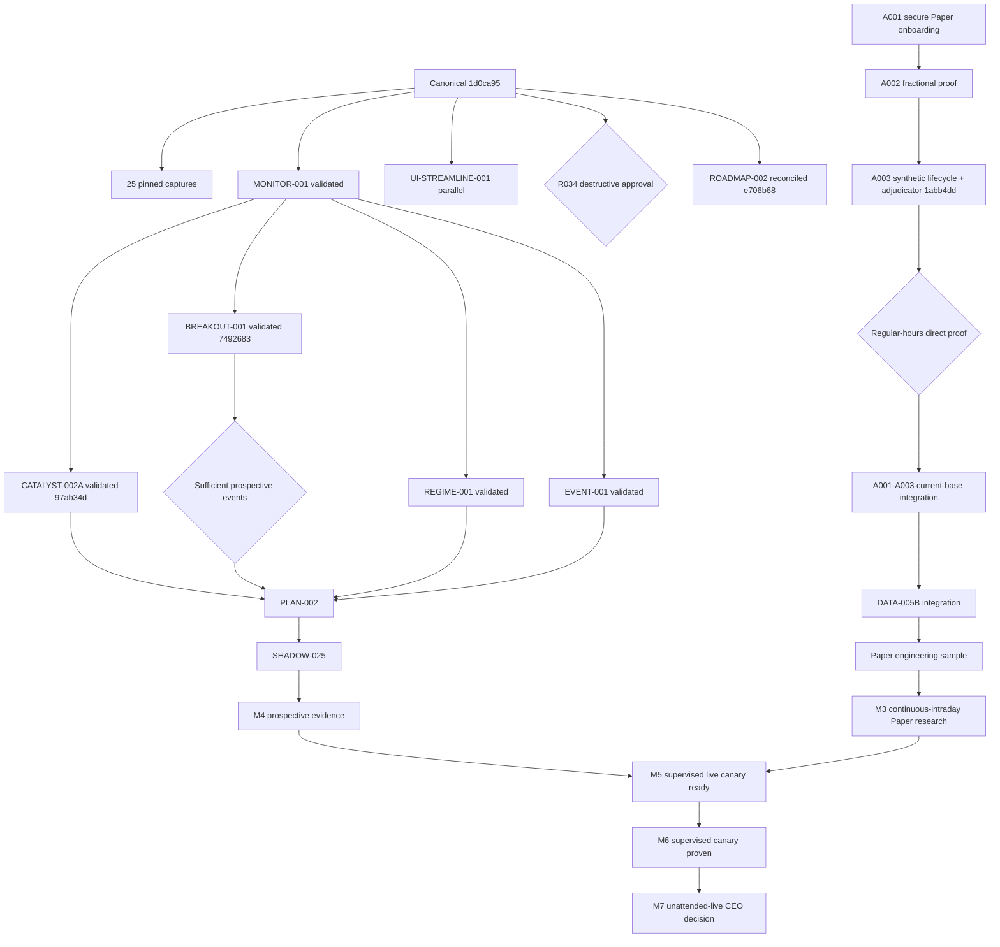

# Momentum Hunter Roadmap

Last reconciled: 2026-08-10

## 1. Authority And Operating Rules

This is Momentum Hunter's authoritative scheduler and current-status document.
It answers what is active, ready, waiting, integration-ready, and complete. It
does not duplicate the project's full chronology.

Supporting records retain detailed evidence:

- [TASK_LOG.md](TASK_LOG.md) - task chronology and proof summaries.
- [CHANGELOG_ARGUS.md](CHANGELOG_ARGUS.md) - delivered changes.
- [BRANCH_LEDGER.md](BRANCH_LEDGER.md) - branch, worktree, merge, and push truth.
- [DECISIONS.md](DECISIONS.md) - durable CEO decisions.
- [RISK_REGISTER.md](RISK_REGISTER.md) - open and mitigated risks.
- `goal-charters/`, `task-contracts/`, and `reports/releases/` - task-level contracts and evidence.
- [VERIFICATION_QUEUE.md](VERIFICATION_QUEUE.md) - only deferred Steven visual/manual checks and anomaly decisions.

Operating rules:

1. Gate only the action or capability the gate exists to protect.
2. External time, provider proof, visual acceptance, CEO decisions, and
   integration windows do not stop unrelated bounded development.
3. Maintain multiple Ready tasks while using one serialized canonical
   integration lane.
4. Permit at most three active implementation worktrees by default. Each must
   have a different primary lane and a documented collision plan for shared
   protected surfaces.
5. Runtime installation, Shadow activation, Paper actions, and live-provider
   actions remain serialized and separately gated.
6. Phase numbers group capabilities; they do not impose exclusive sequential
   execution.
7. The whole project may be called blocked only after every unfinished task is
   dependency-evaluated and the Ready Queue is empty.
8. Prefer one authoritative provider per functional job. Add another provider
   only for a documented capability, reliability, validation, or coverage gap;
   never average or vote providers merely because multiple feeds exist.

## 2. Executive Now

| Area | Current truth |
| --- | --- |
| Canonical Git | Clean `master` equals `origin/master` at `1d0ca95a24b52d5c19e0866914e69880c07a13f5` (`0 / 0`). |
| Installed runtime | `MomentumHunterAutomation` is Running/Automatic from the canonical checkout. Manifest SHA-256 is `E99E65A302B97A5D866071C3C1B37C8519972F8D55966EAC08772A1F6F093B47`. Engine Host reports `Healthy`. |
| Scheduled evidence | 25 enabled opening captures remain, all pinned to `1d0ca95`; next is 2026-08-10 at 08:35 Central and coverage ends 2026-09-14. Zero Shadow jobs are enabled. |
| Shadow | Historical v1/v2/v3 definitions are preserved. Current prospective Shadow is not armed; no current cycle, handoff, order, position, trade, or outcome exists. Official count remains `0 / 30`. |
| Broker safety | Schwab remains read-only market/account evidence. Alpaca work is Paper-only. Real-order transmission is `UNAVAILABLE`; no live Alpaca endpoint or order is authorized. |
| Provider authority | Schwab owns strategy market-data truth; Alpaca Paper owns only Paper order/fill/position/buying-power truth. Execution quotes may be preserved separately as execution evidence, but provider count cannot boost confidence or rewrite a TradePlan. |
| Overnight context | OVERNIGHT-001 `897f18a` proved Alpaca Sunday-night context with limitations: derived overnight quotes were fresh, bars/trades were delayed, and bounded BOATS history supplied sparse OHLCV. SCHWAB-OVERNIGHT-001 `295ab24` then proved the existing Trader API stack insufficient in the same role: quote and Streamer seed evidence was approximately 52 hours old, no Sunday-night update arrived in five minutes, and explicit-window `/pricehistory` returned zero bars. Role adjudication is `ALPACA_DERIVED_FILLS_REAL_SCHWAB_GAP`; Alpaca remains research/context only, with no execution, ranking, breakout-trigger, or TradePlan authority. |
| Schwab after-hours proof | `ARGUS-SCHWAB-AFTER-HOURS-001` is implemented at feature commit `02b46d2` and scheduled for Tuesday 2026-08-11. Independent read-only 15-minute observations run at 15:05 Central / 16:05 Eastern and 18:35 Central / 19:35 Eastern for SPY, QQQ, and NVDA. Both tasks are Ready, wake-enabled, retry-bounded, and pinned to exact clean Git/module identities. Codex is not required; the Windows session must remain logged in for current-user DPAPI. |
| Alpaca Paper | Secure onboarding `39576d9` and fractional proof `256d442` are validated. A003 head `1abb4dd` includes harness `7ccbad5` and adjudication `94c7c77`; direct regular-hours lifecycle acceptance is waiting on market hours. |
| Allocation | Provider-neutral allocation and multi-position research contracts are validated at `046b127`. A separate older activation worktree has seven uncommitted code/test files and is preserved untouched pending reconciliation and A003 evidence. |
| Continuous intraday | Schwab candles, backfill, dense WPF charts, DATA-002 through DATA-005A, and opening automation are canonical. MONITOR `d2b77c2`, CATALYST `97ab34d`, REGIME `f4deb18`, EVENT `b6e861a`, and BREAKOUT `7492683` are validated, pushed, dormant, and unmerged. |
| Active implementation | One of three implementation slots remains occupied by visual-gated UI-STREAMLINE-001 at clean local `989cb7c`; it is deliberately unpushed and unmerged. WORKTREE-HYGIENE-001 is complete as a no-delete audit at pushed closeout `7af33a6` (inventory `5c71b06`); no retirement is authorized. BREAKOUT-001 remains proven/backed up at `7492683`, and ROADMAP-002 remains reconciled at `e706b68`; validated work waits for serialized integration. |
| Highest Ready work | None. Every unfinished inventory item is represented below in the Waiting/Gated Queue or Integration Queue. The project is active: Monday's A003 market-hours proof and scheduled opening capture are external-time work, while UI and cleanup have narrow Steven gates. |
| External-time gates | A003 direct Paper lifecycle acceptance waits for an eligible regular-market session. The independent Schwab after-hours capability proof waits for Tuesday's 4:00-8:00 PM Eastern session. Each blocks only its own provider claim and dependent integration/activation. |
| Steven gates | UI-STREAMLINE-001 visual acceptance; optional WORKTREE-HYGIENE-001 Batch A worktree-only retirement; R034 destructive legacy cutover; any brokerage anomaly; any live order; any unattended-live decision. |

Worktree truth: Git currently knows 74 worktrees, of which 52 are clean and 22
are dirty. Most are historical review/feature checkouts, not active development.
They are preserved, not deleted or reset. The current implementation budget
counts only explicitly active tasks, not every historical checkout.

Current project classification:

```text
A003_LIVE_ACCEPTANCE: WAITING_EXTERNAL_TIME
OVERNIGHT_CONTEXT: PROVEN_WITH_LIMITATIONS_PENDING_INTEGRATION
SCHWAB_OVERNIGHT_DATA: INSUFFICIENT
SCHWAB_AFTER_HOURS_PROOF: SCHEDULED_2026-08-11
PROJECT_DEVELOPMENT: ACTIVE
CANONICAL_INTEGRATION: WAITING_INTEGRATION_WINDOW
ORDER_TRANSMISSION: UNAVAILABLE
```

## 3. Milestone Board

| Milestone | State | Finish line | Critical path |
| --- | --- | --- | --- |
| M1 - Trustworthy Shadow Engineering Ready | IN_PROGRESS | Continuous evidence, setup, plan, risk, allocation, lifecycle, and review chain is integrated and can produce truthful prospective FakeBroker trade/no-trade evidence. | MONITOR -> REGIME/EVENT/CATALYST -> BREAKOUT -> PLAN -> SHADOW-025 |
| M2 - Alpaca Paper Execution Ready | WAITING_EXTERNAL_TIME | Exact Paper host, fractional lifecycle, protective-order behavior, replacement, cleanup, restart/reconciliation, and zero-residual state are directly proven and integrated. | A001 -> A002 -> A003 live acceptance -> integration |
| M3 - Continuous-Intraday Paper Research Ready | IN_PROGRESS | Continuous discovery/monitoring, canonical candles, immutable intraday plans, provider-neutral allocation, and Paper research evidence operate under versioned policies. | M1 contracts + M2 + runtime integration |
| M4 - Prospective Strategy Evidence Underway | NOT_STARTED | A fresh, immutable continuous-intraday sample is activated prospectively; availability and no-trade denominators are preserved. | SHADOW-025 and/or approved Paper engineering sample |
| M5 - Supervised Live Canary Ready | WAITING_DEPENDENCY | Paper capability and evidence gates pass; account isolation, kill path, reconciliation, and a separate live Goal Charter are proven. | M2 -> M3 -> live-canary preparation |
| M6 - Supervised Live Canary Proven | WAITING_DEPENDENCY | Small supervised live canary completes with exact order/account/lifecycle evidence and no unresolved anomaly. | M5 + explicit Steven authorization |
| M7 - Unattended Live Eligible For CEO Decision | WAITING_CEO_DECISION | Repeated supervised evidence, independent audit, revocation/recovery proof, and unattended-live charter are complete. | M6 + separate CEO decision |

### M1 Gate Detail

- Required gates: integrated continuous evidence/context/setup/plan chain, a
  reviewed sample constitution, complete proof bundle, and prospective sample
  identities.
- Satisfied: FakeBroker, Risk Governor, Execution Ledger/Auditor, unattended
  opening capture, canonical candles/charts, DATA-001 through DATA-005A,
  terminal review packets, and dormant MONITOR/REGIME/EVENT implementations.
- Unsatisfied: catalyst updates, sequential breakout research, immutable
  continuous plan versions, current-baseline integration, and new sample
  constitution/activation.
- Critical path: MONITOR -> CATALYST/REGIME/EVENT -> BREAKOUT -> PLAN ->
  SHADOW-025. No official sample may reuse the obsolete opening-heavy v3
  identity.

### M2 Gate Detail

- Required gates: exact Paper endpoint/account lane, fractional order lifecycle,
  protective-order behavior, replacement/cancel recovery, exact liquidation,
  restart/reconciliation, sanitation, and zero residual state.
- Satisfied: encrypted Paper onboarding, exact Paper-host rejection of live,
  direct fractional limit/cancel proof with zero residual state, synthetic A003
  lifecycle/adjudication tooling, and provider-neutral allocation contracts.
- Unsatisfied: direct regular-hours A003 market/fill/protective/replacement/
  liquidation proof and current-baseline integration.
- Critical path: A001 -> A002 -> A003 direct proof -> current-base integration.
  Market-hours evidence blocks provider claims and dependent integration, not
  unrelated development.

### M3 Gate Detail

- Required gates: M2 Paper capability; integrated continuous candidate,
  context, catalyst, plan, allocation, and evidence contracts; versioned Canary
  and strategy-research policies.
- Satisfied: canonical Schwab candles/backfill/WPF, DATA-002 through DATA-005A,
  dormant MONITOR/REGIME/EVENT implementations, provider-neutral allocation,
  and rank-preserving Paper evidence contracts.
- Unsatisfied: A003 live acceptance/integration, current-baseline integration,
  CATALYST, BREAKOUT, PLAN, and prospective Paper policy activation.
- Critical path: A003 -> DATA-005B integration plus MONITOR -> CATALYST/
  BREAKOUT/PLAN -> Paper engineering sample.

### M4 Gate Detail

- Required gates: M1/M3 authority chain, new sample constitution, proof bundle,
  availability denominators, and prospective sample/fill/config/evidence IDs.
- Satisfied: FakeBroker lifecycle, terminal packet, sample-gating, and historical
  v1/v2/v3 preservation mechanisms.
- Unsatisfied: SHADOW-025 constitution, continuous authority integration,
  activation proof, and first terminal prospective decision.
- Critical path: PLAN-002 -> SHADOW-025 -> first valid trade/no-trade receipt.

### M5 Gate Detail

- Required gates: M2-M4 evidence, immutable account/lane binding, exact kill and
  revocation path, reconciliation, security review, and separate supervised-live
  Goal Charter.
- Satisfied: conservative authority model, read-only Schwab account invariant,
  Paper-only Alpaca endpoint isolation on feature branches, and live execution
  prohibition.
- Unsatisfied: accepted Paper lifecycle, repeated prospective evidence, live
  adapter design/review, kill/revoke proof, and CEO-approved canary charter.
- Critical path: M2 + M3 + M4 -> live-canary preparation review.

### M6 Gate Detail

- Required gates: M5, exact supervised order intent, verified account scope,
  current risk decision, bounded quantity, operator presence, and terminal
  lifecycle/reconciliation evidence.
- Satisfied: no real-order capability is currently exposed, preventing premature
  entry into this milestone.
- Unsatisfied: every supervised live canary implementation and operational proof.
- Critical path: M5 -> explicit Steven authorization -> one bounded supervised
  canary -> independent terminal audit.

### M7 Gate Detail

- Required gates: repeated M6 evidence across conditions, independent audit,
  restart/network/clock/provider recovery, kill/revoke proof, unattended-live
  charter, and an explicit final Steven decision.
- Satisfied: unattended service/capture reliability exists only for read-only
  evidence; it grants no order authority.
- Unsatisfied: repeated supervised live proof and every unattended-live-specific
  safety/authority gate.
- Critical path: M6 evidence program -> independent review -> separate CEO
  eligibility decision. No earlier milestone advances automatically.

## 4. Ready Queue

Ready means development prerequisites are satisfied. Queue order is value and
risk order, not permission to bypass integration or activation gates.

| Priority | Task | Lane | Bounded scope and expected output | Dependencies satisfied | Parallel-safe with | Integration constraint |
| --- | --- | --- | --- | --- | --- | --- |
| - | None | - | Every unfinished task is currently integration-gated, provider/time-gated, evidence-gated, destructive-gated, visual-gated, or decision-gated. | Dependency evaluation complete through WORKTREE-HYGIENE-001 `7af33a6`. | - | Recalculate after the next gate transition or integration window. |

Selection note: UI-STREAMLINE-001 occupies one implementation slot while its
visual decision is pending. The other two slots are available, but no inventoried
task is Ready after dependency evaluation. Do not manufacture scope merely to
fill them; recalculate after the A003, UI, integration, or CEO gate changes.

## 5. Active Workstream Lanes

| Lane | Purpose | Current state | Current or next work |
| --- | --- | --- | --- |
| A - Market Data And Monitoring | Schwab Streamer, candles, reconciliation, discovery, monitoring, catalysts. | VALIDATED_PENDING_INTEGRATION / WAITING_EXTERNAL_TIME | Canonical candle stack complete; Tuesday's early/late Schwab after-hours proof is scheduled from frozen feature commit `02b46d2`; MONITOR and CATALYST-002A are validated; CATALYST-002B waits for provider proof. |
| B - Strategy And TradePlan | Setup identity, DATA-004 horizon, breakout/pullback/reclaim, immutable plans. | VALIDATED_PENDING_INTEGRATION / PARALLEL-READY | DATA-003/004 complete; BREAKOUT-001 validated at `7492683`; PLAN-002 waits on the integrated evidence chain. |
| C - Risk / Allocation / Portfolio | Provider-neutral quantities, freshness, buying power, aggregate risk, concurrency. | VALIDATED_PENDING_INTEGRATION | DATA-005B provider-neutral head `046b127`; activation branch preserved dirty and gated. |
| D - Broker / Execution Providers | Broker capabilities, Alpaca Paper lifecycle, future live canary. | WAITING_EXTERNAL_TIME | A003 direct Paper lifecycle proof at next eligible regular-market session. |
| E - Shadow / Evidence / Statistics | Prospective samples, rank evidence, conservative/Paper comparison, terminal packets. | ACTIVE / PARALLEL-READY | SHADOW-024 canonical; research contracts validated; SHADOW-025 waiting on continuous authority chain. |
| F - Operator UI | WPF charts, candidate/plan/position state, workspace simplification. | IMPLEMENTED_PENDING_VISUAL_ACCEPTANCE | UI-STREAMLINE-001 `989cb7c` passes 3 focused and all 254 .NET tests, zero-warning Release build, and nonblank `1180x820` proof; branch remains local/unmerged/unpushed until Steven accepts the visible hierarchy. |
| G - Operations / Reliability | Service, scheduler, wake/clock, health, capture program. | OPERATIONAL | Service healthy; 25 captures pending; integration/install pin currently active. |
| H - Research | Breakouts, RVOL, regime, counterfactuals, event studies, and bounded overnight/extended-hours context. | VALIDATED_PENDING_INTEGRATION / WAITING_EXTERNAL_TIME | OVERNIGHT-001 `897f18a` proved narrow Alpaca Sunday-night context with delayed-bar limitations; SCHWAB-OVERNIGHT-001 `295ab24` proved Schwab insufficient for that Sunday-night role; SCHWAB-AFTER-HOURS-001 `02b46d2` is scheduled to test ordinary Tuesday after-hours behavior early and late without provider blending; DATA-002 is canonical; REGIME and BREAKOUT-001 `7492683` are validated. |
| I - Security / Governance | Credentials, provider isolation, destructive gates, Git/release evidence. | VALIDATED_PENDING_INTEGRATION / DECISION_GATED | ARGUS-ROADMAP-003 and ROADMAP-002 reconciliation are verified pending merge. WORKTREE-HYGIENE-001 `7af33a6` inventories all 74 worktrees with no deletion; optional Batch A waits for exact Steven approval. |

## 6. Waiting / Gated Queue

Every waiting inventory task is listed once below with its complete scheduling
contract. The longer records that follow explain the highest-consequence gates.

| Task | State | Gate | Scope | Blocks | Does NOT block | Resume condition | Parallel-safe / while waiting |
| --- | --- | --- | --- | --- | --- | --- | --- |
| SCHWAB-AFTER-HOURS-001 | SCHEDULED_EXTERNAL_TIME | Tuesday 4:00-8:00 PM Eastern | READ_ONLY_PROVIDER_PROOF | Schwab after-hours authority and any dependent activation | Morning capture, A003, isolated development, existing Schwab regular-session authority | Preserve and adjudicate both 2026-08-11 write-once proofs | No runtime/service/candle-store changes; leave feature worktree clean and Windows session logged in |
| ALPACA-A003-LIVE-ACCEPTANCE | WAITING_EXTERNAL_TIME | Direct regular-hours Paper lifecycle | VERIFICATION + INTEGRATION | A003 acceptance | Independent development | Eligible session and clean zero-residual preflight | All nonprovider lanes; offline adjudication |
| ALPACA-A003-INTEGRATION | WAITING_PROVIDER_EVIDENCE | Successful sanitized A003 terminal evidence | INTEGRATION | Alpaca stack merge | Feature development and provider-neutral tests | A003 live pass and current-base revalidation | CATALYST, BREAKOUT, UI, governance |
| DATA-005B-INTEGRATION | WAITING_DEPENDENCY | A003 capability truth and current-base reconciliation | INTEGRATION | Canonical allocator/evidence contracts | Generic tests and other lanes | A003 pass, policy split, full reverify | Research, UI, monitoring, governance |
| DATA-005B-SHADOW-ACTIVATION | WAITING_DEPENDENCY | Integrated allocator plus prospective policies | DEVELOPMENT + ACTIVATION | Official Shadow/Paper quantities | Provider-neutral work and research | Dirty branch reviewed; fresh reconciliation; policies frozen | Evidence models and synthetic fixtures |
| MONITOR-001-INTEGRATION | WAITING_INTEGRATION_WINDOW | Scheduled runtime pin | INTEGRATION + INSTALLATION | Canonical MONITOR module | All isolated development | Terminal capture plus selected integration/repin window | CATALYST/BREAKOUT stacked development |
| REGIME-001-INTEGRATION | WAITING_INTEGRATION_WINDOW | MONITOR commit order and runtime pin | INTEGRATION + INSTALLATION | Canonical REGIME module | All isolated development | MONITOR order, current-base reverify, integration window | Research and provider-neutral work |
| EVENT-001-INTEGRATION | WAITING_INTEGRATION_WINDOW | REGIME/MONITOR commit order and runtime pin | INTEGRATION + INSTALLATION | Canonical EVENT module | All isolated development | Exact stack order, full reverify, integration window | Catalyst, research, UI, governance |
| EVENT-002-SOURCE-AND-POLICY | WAITING_PROVIDER_EVIDENCE | Authoritative source and prospective policy | VERIFICATION + ACTIVATION | Production event context | Dormant model and all unrelated lanes | Source contract plus policy proof | Provider research and unavailable-state UI |
| CATALYST-002B-PROVIDER | WAITING_PROVIDER_EVIDENCE | Accepted catalyst source contract | VERIFICATION + ACTIVATION | Live catalyst intake | CATALYST integration and unrelated work | Provider/source proof, CATALYST-002A integration, and bounded cadence | Synthetic intake and authority tests |
| BREAKOUT-001-INTEGRATION | WAITING_INTEGRATION_WINDOW | MONITOR commit order and runtime pin | INTEGRATION + INSTALLATION | Prospective sequence collection | All isolated development | MONITOR first, current-base reverify, integration window | UI, governance, and offline research |
| BREAKOUT-002 | WAITING_DEPENDENCY | Sufficient prospective BREAKOUT-001 cohort | DEVELOPMENT | Outcome conclusions | BREAKOUT-001 and other lanes | Frozen cohort/denominator minimum met | Analysis fixtures and integrity tooling |
| PLAN-002 | WAITING_DEPENDENCY | Integrated authority/context/setup chain | DEVELOPMENT + ACTIVATION | Continuous authoritative plans | Research, Paper proof, UI, governance | Prerequisites integrated; identities frozen | Synthetic version/supersession tests |
| SHADOW-025 | WAITING_DEPENDENCY | Full authority chain and sample constitution | ACTIVATION | New official sample | Implementation/evidence preparation | M1 finish line and new prospective IDs | Report/proof-bundle preparation |
| PAPER-ENGINEERING-001 | WAITING_DEPENDENCY | A003 and DATA-005B integrated | PAPER_EXECUTION | Prospective Paper decisions | FakeBroker, research, UI, data | Accepted capability/policy baseline | Paper evidence/reporting fixtures |
| R034 | WAITING_DESTRUCTIVE_APPROVAL | Exact archive/delete/rebuild plan | DESTRUCTIVE_OPERATION | Legacy deletion/cutover | Every non-destructive lane | Steven approves named targets/rollback | Keep verifier current; no mutation |
| SCHWAB-PAPER-ADAPTER | WAITING_VENDOR_CAPABILITY | Vendor paperMoney/sandbox API | DEVELOPMENT + PAPER_EXECUTION | Schwab automated Paper only | Alpaca Paper and all other lanes | Vendor capability changes | Preserve vendor evidence |
| LIVE-CANARY-PREPARATION | WAITING_DEPENDENCY | M2-M4 evidence | DEVELOPMENT + LIVE_EXECUTION | M5 readiness | Paper/Shadow/research/UI/data | M2-M4 pass and separate charter | Nontransmitting security design |
| SUPERVISED-LIVE-CANARY | WAITING_CEO_DECISION | Exact supervised real-order authorization | LIVE_EXECUTION | Any supervised live order | All nonlive work | M5 plus Steven's bounded decision | Paper and evidence collection |
| UNATTENDED-LIVE | WAITING_CEO_DECISION | Separate unattended-live charter/decision | LIVE_EXECUTION | Unattended real orders | Supervised/manual and nonlive work | M6, audit/revocation proof, Steven decision | Reliability/security research only |

### ALPACA-A003-LIVE-ACCEPTANCE

Task: Direct Alpaca Paper lifecycle proof and adjudication.

Lane: D

Priority: P0 when an eligible regular-market window opens.

State: `WAITING_EXTERNAL_TIME`

Gate: One bounded direct Paper proof from exact source head `1abb4dd`.

Gate scope: `VERIFICATION + INTEGRATION`

Blocks: A003 acceptance; Alpaca behavior-dependent integration; freezing
provider-specific execution semantics; Paper activation.

Does NOT block: provider-neutral allocation; synthetic portfolio tests; Paper
evidence schemas; offline adjudication; catalyst/breakout/UI/governance work.

Resume condition: eligible regular-market session, exact Paper endpoint and
canary lane, clean preflight, zero initial residual positions/orders.

While waiting: continue Ready Queue work and preserve the live run as one
push-button bounded proof.

### CANONICAL-INTEGRATION-WINDOW

Task: Merge/install validated feature work one candidate at a time.

Lane: G (primary); Lane I coordinates Git integration.

Priority: P0 after the next scheduled capture is terminal and preserved.

State: `WAITING_INTEGRATION_WINDOW`

Gate: all 25 opening jobs are pinned to canonical `1d0ca95`; the installed
service is running that checkout.

Gate scope: `INTEGRATION + INSTALLATION`

Blocks: changing canonical HEAD without deliberate job repin and installed
runtime proof.

Does NOT block: isolated implementation, tests, research, architecture,
reports, provider-neutral work, or feature-branch backup pushes.

Resume condition: preserve terminal scheduled evidence, select one integration
candidate, reconcile current master, reverify, fast-forward, and deliberately
repin/reprove the installed lane if required.

While waiting: maintain the Ready Queue and Integration Queue; do not mutate
the manifest or service merely to make documentation current.

### DATA-005B-SHADOW-ACTIVATION

Task: Connect provider-neutral allocation to prospective Shadow/Paper policy.

Lane: C (primary); Lane E consumes the resulting evidence contract.

Priority: P1

State: `WAITING_DEPENDENCY`

Gate: A003 acceptance, current-base reconciliation, separately frozen Canary
and research policies, and clean proof of the existing dirty worktree.

Gate scope: `DEVELOPMENT` for activation wiring; generic design is complete.

Blocks: selector/Shadow/Paper allocation activation and official quantities.

Does NOT block: allocator tests, evidence contracts, catalyst/research/UI work.

Resume condition: A003 capabilities adjudicated, dirty worktree reviewed, and a
fresh reconciliation branch created without rewriting its history.

While waiting: preserve the seven-file worktree unchanged; use validated
provider-neutral commit `046b127` as the generic contract reference.

### EVENT-002-SOURCE-AND-POLICY

Task: Select and prove an authoritative event source and freeze prospective
event windows/consequences.

Lane: A (primary); Lane H consumes event context for research.

Priority: P2

State: `WAITING_PROVIDER_EVIDENCE`

Gate: source capability and explicit prospective policy evidence.

Gate scope: `VERIFICATION + ACTIVATION`

Blocks: production event intake and authority-bearing event context.

Does NOT block: EVENT-001 model integration, catalyst contracts, breakout
research, provider research, UI unavailable states.

Resume condition: source and policy task with proof; no inferred windows.

While waiting: use EVENT-001 only as dormant deterministic infrastructure.

### BREAKOUT-002

Task: Prospective sequential breakout event study.

Lane: H

Priority: P2

State: `WAITING_DEPENDENCY`

Gate: sufficient prospectively captured BREAKOUT-001 events.

Gate scope: `DEVELOPMENT` for outcome claims, not BREAKOUT-001 collection.

Blocks: event-study conclusions and any later authority proposal.

Does NOT block: BREAKOUT-001 implementation, other research, Paper proof, UI.

Resume condition: frozen cohort and denominator minimum are met.

While waiting: implement capture/integrity mechanics and synthetic analysis.

### PLAN-002

Task: Immutable continuous-intraday plan versions.

Lane: B

Priority: P1

State: `WAITING_DEPENDENCY`

Gate: integrated MONITOR, catalyst authority, event/regime context, DATA-002,
and accepted setup semantics.

Gate scope: `DEVELOPMENT + ACTIVATION`

Blocks: authority-bearing continuous plans and SHADOW-025.

Does NOT block: research capture, Paper capability proof, UI, governance.

Resume condition: prerequisite contracts are integrated and policy identities
are frozen prospectively.

While waiting: synthetic plan-version fixtures may be expanded without runtime
wiring.

### SHADOW-025

Task: New continuous-intraday prospective FakeBroker sample.

Lane: E

Priority: P1

State: `WAITING_DEPENDENCY`

Gate: complete authority chain, proof bundle, required visual acceptance, and
separately reviewed sample constitution.

Gate scope: `ACTIVATION`

Blocks: starting/counting the new official sample.

Does NOT block: implementation, synthetic tests, Paper research, UI, reports.

Resume condition: M1 finish line and new sample/fill/config/evidence identities.

While waiting: preserve v1/v2/v3 unchanged and prepare evidence/reporting.

### R034

Task: Archive and remove active legacy CRWV candle evidence and its 710 SQLite
mirror rows.

Lane: A (primary); Lane I governs the destructive approval boundary.

Priority: P3

State: `WAITING_DESTRUCTIVE_APPROVAL`

Gate: Steven approval after exact plan-only targets and rollback evidence are
presented immediately before action.

Gate scope: `DESTRUCTIVE_OPERATION`

Blocks: deletion/rebuild and final legacy cutover completion.

Does NOT block: strategy, Paper, portfolio research, UI, non-destructive data
work, or new Schwab candle collection.

Resume condition: explicit approval of the exact archive/delete/rebuild plan.

While waiting: keep R034A verifier and legacy evidence unchanged.

### UI-VISUAL-ACCEPTANCE

Task: Accept UI-STREAMLINE-001 workstation hierarchy at `989cb7c`.

Lane: F

Priority: task-specific.

State: `WAITING_VISUAL_ACCEPTANCE`; 3 focused and all 254 .NET tests, the
zero-warning Release build, and nonblank `1180x820` synthetic proof pass.

Gate scope: `INTEGRATION` for visual behavior.

Blocks: acceptance/integration of the specific visual task.

Does NOT block: other lanes or nonvisual work.

Resume condition: Steven performs the numbered checks and reports pass/failure.

While waiting: preserve the branch and continue noncolliding work.

### WORKTREE-HYGIENE-BATCH-A

Task: Optional worktree-only retirement of the 19 clean, merged paths named in
WORKTREE-HYGIENE-001 `7af33a6`.

Lane: I

Priority: P3

State: `WAITING_CEO_DECISION`

Gate: exact Steven approval followed by immediate no-drift revalidation.

Gate scope: `DESTRUCTIVE_GIT_WORKTREE_OPERATION`

Blocks: only the optional reduction from 74 to 55 registered worktrees.

Does NOT block: development, integration planning, A003 proof, scheduled
captures, UI acceptance, research, Paper work, or runtime operations.

Resume condition: Steven states `APPROVE WORKTREE-HYGIENE-001 BATCH A
WORKTREE-ONLY RETIREMENT; RETAIN ALL BRANCHES`, and every named path is still
clean, merged, process-free, and outside the canonical/installed lane.

While waiting: retain all worktrees and branches; do not reset, stash, prune,
force-remove, or act on dirty/detached/local-only checkouts.

### SCHWAB-PAPER-ADAPTER

Task: Schwab Paper broker adapter.

Lane: D

Priority: P4

State: `WAITING_VENDOR_CAPABILITY`

Gate: Schwab does not expose Trader API access to paperMoney and has no current
retail sandbox.

Gate scope: `DEVELOPMENT + PAPER_EXECUTION`

Blocks: automated Schwab Paper adapter only.

Does NOT block: Alpaca Paper, Schwab market data, FakeBroker, research, UI.

Resume condition: documented vendor capability materially changes.

While waiting: use Alpaca Paper as the approved execution laboratory.

### LIVE-CANARY-AND-UNATTENDED

Task: Supervised live canary, then potential unattended live eligibility.

Lane: D (primary); Lane I governs authorization and audit boundaries.

Priority: P4 until M2-M4 pass.

State: `WAITING_CEO_DECISION`

Gate: separate Goal Charters, repeated evidence, account isolation, kill/revoke
proof, and explicit Steven authorization for each consequential step.

Gate scope: `LIVE_EXECUTION`

Blocks: any real Alpaca order and unattended-live capability.

Does NOT block: Paper, FakeBroker, research, UI, data, reliability, governance.

Resume condition: milestone prerequisites pass and Steven authorizes the exact
bounded action.

While waiting: no live endpoint or live adapter path is created.

## 7. Integration Queue

The queue records validated work separately from merge readiness. Integration
is one candidate at a time; no row authorizes a merge by itself.

| Task / branch | Validated identity | Validation state | Integration prerequisite | Runtime pin | Visual gate | Revalidation |
| --- | --- | --- | --- | --- | --- | --- |
| ROADMAP-003 parallel pipeline governance | `b74f72a` plus branch-local closeout | Docs/governance verification passed; feature branch backup only | Serialized integration window on current master | Yes | No | Diff, reference, contradiction, inventory, and secret scans |
| ROADMAP-002 continuous architecture | `e706b68` includes implementation `1cf60ea`; source `bae053b` / `013cafd` preserved | Current-master docs reconciliation verified and pushed; all five source hashes preserved | Serialized integration window on current master | Yes | No | Diff, link, lineage, containment, contradiction, secret, and canonical-nonmutation scans |
| Alpaca A001 secure onboarding | `39576d9` | Code/tests verified; pushed | Integrate only as cumulative A001-A003 chain after A003 live acceptance | Yes | No | Full current-baseline code/security tests |
| Alpaca A002 fractional capability | `256d442` | Direct fractional limit/cancel proof; zero residual state; pushed | A003 live acceptance and cumulative chain reconciliation | Yes | No | Secret/endpoint/order safety and full tests |
| Alpaca A003 lifecycle | `1abb4dd` includes `7ccbad5` + `94c7c77` | Synthetic/adjudication verified; pushed; direct proof pending | Successful direct regular-hours proof with terminal zero positions/orders | Yes | No | Direct evidence scan plus full branch verification |
| OVERNIGHT-001 read-only market data | `897f18a` | SPY/QQQ/NVDA Sunday-night proof; 10 focused, 121 adjacent, and 1,401 full tests pass; clean/pushed | Reconcile after the cumulative Alpaca credential boundary is integrated; no production wiring is implied | Yes | No | Current-base tests, exact-host GET-only scan, secret scan, proof-hash verification |
| SCHWAB-OVERNIGHT-001 read-only fidelity probe | `295ab24` | Five-minute SPY/QQQ/NVDA proof classified `SCHWAB_OVERNIGHT_DATA_INSUFFICIENT`; 8 focused, 169 adjacent, and 1,322 full tests pass; clean/pushed | Reconcile with OVERNIGHT-001 in a serialized docs/research integration window; no production wiring is implied | Yes | No | Current-base tests, GET/Streamer-only scan, secret scan, proof-fingerprint verification |
| SCHWAB-AFTER-HOURS-001 read-only proof | `02b46d2` | 10 focused, 100 affected, and 1,332 full Python tests pass; two one-time Tuesday tasks installed and pinned; feature branch clean/pushed | Preserve and adjudicate both 2026-08-11 early/late proofs, then reconcile in a serialized integration window; no production wiring is implied | Yes | No | Exact task/Git/module identity, write-once proof fingerprints, quote/candle freshness, OHLC/history reconciliation, secret and GET/Streamer-only scans |
| DATA-005B provider-neutral allocation | `046b127` | 33 focused, 199 adjacent, 1,424 full tests; pushed | A003 acceptance; policy split; current-master reconciliation | Yes | No | Full allocator/Paper/Shadow suite |
| MONITOR-001 | `d2b77c2` | 38 focused, 195 adjacent, 1,352 full; clean/pushed | Serialized integration window | Yes | No | Current-master full tests before merge |
| CATALYST-002A | `97ab34d` includes implementation `c53a24b` and MONITOR | 43 focused, 158 bounded, 1,395 full; clean/pushed/dormant | MONITOR first; reconcile the REGIME/EVENT sibling stack in one serialized integration window | Yes | No | Current-master full tests and provider/runtime boundary scan before merge |
| REGIME-001 | `f4deb18` includes MONITOR | 29 focused, 145 adjacent, 1,381 full; clean/pushed | MONITOR order; serialized integration window | Yes | No | Current-master full tests before merge |
| EVENT-001 | `b6e861a` includes REGIME + MONITOR | 30 focused, 167 adjacent, 1,411 full; clean/pushed | Preserve commit order; serialized integration window | Yes | No | Current-master full tests before merge |
| BREAKOUT-001 | `7492683` includes implementation `2d9b616` and MONITOR `b71feb0` | 20 focused, 188 adjacent, 1,372 full; clean/pushed/dormant | MONITOR first; reconcile stacked lineage in a serialized integration window | Yes | No | Current-master full tests plus research-authority and source-nonmutation scans |
| UI-STREAMLINE-001 | `989cb7c` | 3 focused and 254 full .NET tests pass; zero-warning Release build; nonblank `1180x820` synthetic offscreen proof; clean/local only | Steven passes the six exact checks in `VERIFICATION_QUEUE.md`, then current-master revalidation in a serialized integration window | Yes | Yes | Focused hierarchy, full .NET, minimum-size visual, secret/capability, and canonical-nonmutation checks |
| WORKTREE-HYGIENE-001 | `7af33a6` includes inventory `5c71b06` | Complete 74-row inventory, exact category reconciliation, live Batch A recheck, docs-only diff, secret scan, and canonical/service nonmutation pass; clean/pushed | Serialized current-master reconciliation because sibling UI/governance branches append shared docs; cleanup decision is separate | Yes | No | Recount, JSON/report hash, changed-path, secret, canonical/service, and no-worktree-removal checks |

Superseded branches and historical review worktrees remain discoverable in
[BRANCH_LEDGER.md](BRANCH_LEDGER.md). They do not enter this queue merely
because their worktree still exists.

## 8. Gate Register

| Gate ID | Gate | Scope | Blocks | Does not block | Resume evidence |
| --- | --- | --- | --- | --- | --- |
| G-A003-TIME | Eligible regular-market A003 proof | VERIFICATION + INTEGRATION | A003 acceptance and Alpaca-dependent semantics | All independent development | Terminal sanitized lifecycle, zero residual positions/orders, exact Paper host |
| G-SCHWAB-AH-TIME | Tuesday 4:00-8:00 PM Eastern after-hours proof | VERIFICATION + INTEGRATION | Schwab after-hours authority and dependent activation | Morning capture, A003, existing regular-session authority, isolated development | Two terminal write-once proofs from exact pinned source; fresh three-symbol OHLCV and price-history adjudication |
| G-RUNTIME-PIN | 25 jobs pinned to `1d0ca95` | INTEGRATION + INSTALLATION | Canonical/runtime changes without repin | Feature work, tests, docs, research | Terminal scheduled evidence plus deliberate re-pin/reproof |
| G-SHADOW-ACTIVATE | New sample constitution | ACTIVATION | SHADOW-025 start/counting | Implementation and evidence preparation | Full authority chain, proof bundle, prospective identities |
| G-R034 | Exact legacy archive/delete plan | DESTRUCTIVE_OPERATION | Legacy deletion/rebuild | All non-destructive work | Steven approval of named targets and rollback |
| G-UI | Steven visual acceptance | INTEGRATION | Specific UI task acceptance | Nonvisual and other-lane work | Numbered manual pass |
| G-WORKTREE-BATCH-A | Exact 19-path worktree-only retirement | DESTRUCTIVE_GIT_WORKTREE_OPERATION | Optional worktree-count reduction only | Development, captures, Paper proof, integration planning, UI, runtime | Exact Steven phrase plus immediate clean/merged/process/path revalidation; retain all branches |
| G-EVENT-SOURCE | Authoritative calendar source/policy | VERIFICATION + ACTIVATION | Production event context | Dormant model and other lanes | Source and prospective policy proof |
| G-LIVE | Explicit supervised/unattended authorization | LIVE_EXECUTION | All real orders/unattended trading | Paper, Shadow, research, UI, data | Milestone evidence plus exact CEO decision |
| G-GIT-RECONCILE | Divergent/dirty historical branch | INTEGRATION | Direct merge of that branch | Read-only classification and fresh reconciliation | New branch from current master, exact cherry-picks where suitable, full reverify |

## 9. Dependency Graph



Important nondependencies:

- Validated CATALYST-002A, BREAKOUT-001, UI-STREAMLINE-001, and governance work do not
  depend on A003 live acceptance.
- A003 live acceptance does not depend on Codex, the WPF UI, Shadow activation,
  or a service/runtime merge.
- R034 deletion does not precede strategy, Paper, or research work.
- The provider-minimalism guardrail does not block A003, Schwab data work,
  provider-neutral adapters, Paper research, or continuous monitoring. It
  governs only future proposals to add or elevate a provider.
- OVERNIGHT-001 and SCHWAB-OVERNIGHT-001 do not block A003, DATA-005
  provider-neutral work, Monday capture, Shadow engineering, or any other lane.
  Together they establish that Alpaca's derived feed fills a real Schwab
  Sunday-night coverage gap, but they grant only a narrow research/context role
  and create no execution, ranking, TradePlan, or provider-blending authority.

## 10. Phase / Capability Inventory

Phase numbers are capability groups, not exclusive execution order. The table
below is the one-record-per-task active inventory. Ready, Waiting, and
Integration sections are scheduling projections of these records.

| Task | Primary lane | Priority | State | Depends on | Unlocks |
| --- | --- | --- | --- | --- | --- |
| ROADMAP-003 | I | P0 | IMPLEMENTED_PENDING_MERGE | Canonical/runtime reconciliation | Parallel pipeline governance |
| ROADMAP-002-RECONCILE | I | P1 | IMPLEMENTED_PENDING_INTEGRATION | Reconciled `e706b68`; source `bae053b` preserved | Canonical continuous architecture artifacts |
| ALPACA-A003-LIVE-ACCEPTANCE | D | P0 | WAITING_EXTERNAL_TIME | A001/A002/A003 code | A003 acceptance |
| ALPACA-A003-INTEGRATION | D | P1 | WAITING_PROVIDER_EVIDENCE | A003 live pass | Accepted Paper capability baseline |
| OVERNIGHT-001 | H | P2 | IMPLEMENTED_PENDING_INTEGRATION | Active Sunday overnight session; validated `897f18a` | Optional bounded overnight-context snapshot research |
| SCHWAB-OVERNIGHT-001 | H | P2 | IMPLEMENTED_PENDING_INTEGRATION | Active Sunday overnight session; validated `295ab24` | Provider-minimalism adjudication; Alpaca retains narrow context role |
| DATA-005B-INTEGRATION | C | P1 | WAITING_DEPENDENCY | A003 pass + reconciliation | Provider-neutral account/portfolio allocation |
| DATA-005B-SHADOW-ACTIVATION | C | P1 | WAITING_DEPENDENCY | DATA-005B integration + policy identities | Prospective allocated FakeBroker/Paper decisions |
| MONITOR-001-INTEGRATION | A | P1 | WAITING_INTEGRATION_WINDOW | Validated `d2b77c2` | Runtime candidate lifecycle work |
| REGIME-001-INTEGRATION | H | P1 | WAITING_INTEGRATION_WINDOW | MONITOR commit order; validated `f4deb18` | Versioned regime context |
| EVENT-001-INTEGRATION | H | P1 | WAITING_INTEGRATION_WINDOW | REGIME/MONITOR commit order; validated `b6e861a` | Dormant event context |
| EVENT-002-SOURCE-AND-POLICY | A | P2 | WAITING_PROVIDER_EVIDENCE | EVENT-001; source/policy proof | Production event context |
| CATALYST-002A | A | P1 | IMPLEMENTED_PENDING_INTEGRATION | DATA-001/001B; MONITOR contract; validated `97ab34d` | Provider-neutral continuous catalyst evidence |
| CATALYST-002B-PROVIDER | A | P2 | WAITING_PROVIDER_EVIDENCE | CATALYST-002A integration; source contract | Live catalyst intake |
| BREAKOUT-001 | H | P2 | IMPLEMENTED_PENDING_INTEGRATION | Canonical candles; MONITOR identity; validated `7492683` | Prospective sequence corpus |
| BREAKOUT-002 | H | P2 | WAITING_DEPENDENCY | Sufficient BREAKOUT-001 events | Sequential event study |
| PLAN-002 | B | P1 | WAITING_DEPENDENCY | MONITOR, DATA-002, REGIME, EVENT, CATALYST, setup evidence | Continuous immutable plans |
| SHADOW-025 | E | P1 | WAITING_DEPENDENCY | Full continuous authority chain | New FakeBroker prospective sample |
| PAPER-ENGINEERING-001 | D | P1 | WAITING_DEPENDENCY | A003 + DATA-005B integration | Prospective Paper trade/no-trade evidence |
| UI-STREAMLINE-001 | F | P2 | IMPLEMENTED_PENDING_VISUAL_ACCEPTANCE | Validated local `989cb7c`; Steven's six visual checks | Quieter workstation UI |
| R034 | A | P3 | WAITING_DESTRUCTIVE_APPROVAL | R034A complete; exact CEO approval | Final legacy cutover |
| SCHWAB-PAPER-ADAPTER | D | P4 | WAITING_VENDOR_CAPABILITY | Vendor sandbox/paper capability | Same-provider automated Paper path |
| LIVE-CANARY-PREPARATION | D | P4 | WAITING_DEPENDENCY | M2-M4 | M5 readiness review |
| SUPERVISED-LIVE-CANARY | D | P4 | WAITING_CEO_DECISION | M5 + exact authorization | M6 evidence |
| UNATTENDED-LIVE | D | P4 | WAITING_CEO_DECISION | M6 + separate charter | M7 decision |
| WORKTREE-HYGIENE-001 | I | P3 | IMPLEMENTED_PENDING_INTEGRATION | Validated/pushed closeout `7af33a6`; no-delete audit complete | Complete inventory and retirement plan |
| WORKTREE-HYGIENE-BATCH-A | I | P3 | WAITING_CEO_DECISION | Exact approval plus fresh no-drift proof | Optional 19-worktree reduction; all branches retained |

Capability groups:

- Phases 0-3: governance, mapping, scoped delivery, and release discipline.
- Phases 4-6: automation/simulation foundations and research primitives.
- Phases 7-10: WPF shell, headless Python engine, read-only integration, and
  FakeBroker planning/risk/simulation.
- Phase 11: Shadow evidence and operational hardening.
- Phase 12: incremental WPF/candle/continuous capability migration.
- Phase 13: Paper execution validation and prospective Paper research.
- Phase 14: supervised and unattended live gates.

### Future Architecture Guardrails

`PROVIDER-MINIMALISM` is recorded as
`FUTURE_IDEA_RECORDED_NO_RUNTIME_CHANGE`, not as an active task or sequential
gate. The preferred role model is Schwab for strategy market data, Alpaca Paper
for Paper execution truth, an explicitly approved future live broker for live
execution truth, attributed sources for catalyst truth, and a separately
approved source for overnight context only if a real coverage gap is proven.
OVERNIGHT-001 proved that narrow gap can be partially filled by Alpaca derived
overnight quotes plus delayed BOATS history. SCHWAB-OVERNIGHT-001 then tested
the existing authoritative provider directly and found only Friday-close
quotes/Streamer seed rows plus zero Sunday-night price-history bars. The role
adjudication is therefore `ALPACA_DERIVED_FILLS_REAL_SCHWAB_GAP`, but neither
proof grants execution, ranking, breakout-trigger, TradePlan, or canonical
strategy authority.
Any future provider proposal must name the problem, current source limitation,
proposed capability, cost, authority role, and exit condition. A formal
cross-provider divergence system remains conditional on prospective evidence
of a consequential discrepancy.

## 11. Completed Capability Summary

| Capability | Current truth | Evidence reference |
| --- | --- | --- |
| Governance and Hard Chew | Agent roles, Goal Steward, Git Steward, proof gates, branch safety, and delegated nonvisual integration policy are established. | `AGENTS.md`, `OPERATING_RULES.md`, `TASK_LOG.md` |
| Python simulation foundation | TradePlan, Risk Governor, FakeBroker, Execution Ledger, Execution Auditor, and simulation UI contracts are canonical. | `reports/releases/ARGUS-A014-A015C-simulation-cockpit-auditor-gate.md` |
| WPF workstation | WPF is the canonical operator shell; Python is the canonical engine. Docking, tray lifecycle, linked evidence, charting, and presentation migrations are integrated. | Phase 7-10 release reports |
| Headless reliability | Windows service, Engine Host, scheduler, wake/clock hardening, reboot canaries, and unattended 08:35 capture are operational. | Service/SHADOW release reports and operational receipts |
| Opening evidence integrity | DATA-001/001B/001C preserve quote/catalyst authority and fail untrusted evidence closed. | DATA release reports |
| Candle platform | Schwab Streamer contract, price-history reconciliation, bounded collector, historical/automatic backfill, dense WPF charts, and legacy-consumer migration are canonical. | R031-R034A release reports |
| Intraday data and planning | DATA-002 time-normalized RVOL, DATA-003 setup identity, DATA-004 same-session horizons, DATA-005 allocation gate, and DATA-005A account snapshots are canonical. | DATA release reports |
| Offline terminal review | SHADOW-024 deterministic, sanitized terminal packets are canonical and downstream-only. | `reports/releases/ARGUS-SHADOW-024-offline-terminal-review-packet.md` |
| Paper onboarding/proof | Secure Alpaca Paper onboarding and one fractional limit/cancel proof are validated on feature branches; they are not canonical runtime capabilities. | A001/A002 branch evidence |

Detailed completed chronology remains in the supporting ledgers. Historical
branches are not active merely because they remain checked out.

## 12. Governance / Update Protocol

### Scheduling Pass

At every task completion or gate transition:

1. Reconcile Git, current worktrees, runtime pins, and external evidence.
2. Mark completed prerequisites.
3. Recalculate every unfinished task's dependency state.
4. Populate the Ready Queue with every task whose development prerequisites are
   satisfied.
5. Populate the Waiting Queue with the narrow gate scope, Blocks, Does NOT
   block, resume evidence, and While Waiting work.
6. Populate the Integration Queue from actual validated branch identities.
7. Select the highest-value Ready task that fits the three-worktree budget and
   does not collide with protected active work.
8. Integrate only one candidate at a time after current-baseline revalidation.
9. If Ready is empty, prove every unfinished task is dependency-blocked before
   calling the project blocked.

### Standard Task Record

```text
TASK:
Lane:
Priority:
State:
Outcome:
Depends on:
Unlocks:
Gate:
Gate scope:
Blocks:
Does NOT block:
Parallel-safe with:
Integration prerequisites:
Steven decision required:
Next evidence:
While waiting:
```

### Branch And Worktree Policy

- Maximum three active implementation worktrees by default; fewer when merge
  risk exceeds throughput value.
- Each active worktree records base master, task ID, primary lane, protected
  paths, dependencies, and integration prerequisites.
- One canonical integration lane exists. Runtime installation and Shadow/Paper/
  live activation remain serialized.
- Do not rebase validated remote-backed history. If master advances, create a
  fresh reconciliation branch, apply exact validated commits when suitable,
  record source identities, resolve only bounded conflicts, and rerun full
  required verification.
- Never reset, force-push, delete, or perform undocumented non-fast-forward
  integration without the applicable Steven decision.

### Roadmap Update Triggers

Update this Roadmap when a task changes state, a gate opens/closes, a dependency
changes, a branch enters/leaves the Integration Queue, a milestone changes, a
CEO decision changes direction, or a material defect changes sequencing.

Routine successful captures stay in append-only operational evidence and do
not force a canonical Roadmap commit, Git identity change, or job repin.

### Priority Model

- P0: immediate safety/correctness blocker or time-sensitive proof.
- P1: milestone critical path.
- P2: high-value parallel work.
- P3: useful noncritical improvement.
- P4: deferred/research backlog.

Priority never overrides a safety gate. An unavailable P0 task does not prevent
a Ready P1 or P2 task from proceeding.

### Protected Boundaries

Scoring, ranking, readiness, TradePlan semantics, Risk Governor, provider
configuration, account binding, credentials, service/scheduler/Engine Host,
Shadow activation, database/schema, destructive data changes, Paper actions,
and live execution remain protected by their exact task and gate. This roadmap
refactor changes no runtime behavior or authority.
