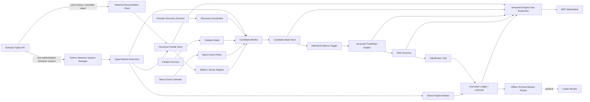
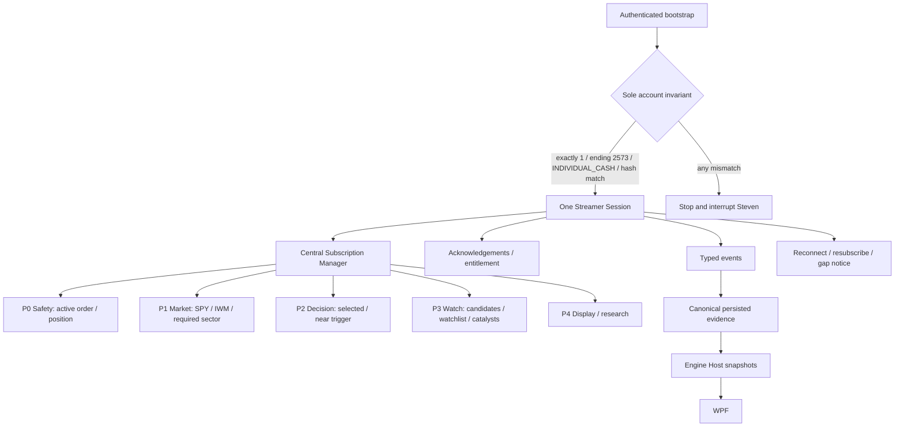

# Continuous Intraday Market Awareness Architecture

## Status And Boundary

This is the target architecture for a continuous Momentum Hunter intraday
runtime. It is a contract and sequencing artifact, not runtime implementation.

The opening capture at 08:35 Central remains an immutable morning bootstrap:
it establishes the first broad candidate set, market context, and evidence
checkpoint. Continuous operation then maintains a bounded watch set, consumes
events, reevaluates only on meaningful evidence change, versions plans, and
preserves every terminal or blocked result. No component receives permission to
transmit a real order.

The bootstrap's bounded role is to establish the initial market regime,
overnight/opening gaps, opening liquidity, candidate universe, catalysts,
TradePlans, risk posture, SPY/IWM context, and available sector context. Every
one of those facts retains its own source clock and may later become stale,
superseded, or invalidated. The bootstrap is the first event of the day, not the
final market opinion.

## Current Versus Target Gap

| Capability | Current implementation | Target state | Gap owner |
| --- | --- | --- | --- |
| Opening bootstrap | Unattended 08:35 capture and TradePlan reports | Retained as first session checkpoint | Existing service |
| Broad discovery | Scheduled capture-oriented scans | Bounded periodic discovery throughout eligible sessions | `MONITOR-001` |
| Candidate monitoring | Five-minute Shadow candidate cycle plus active-position quote loop | Event-aware watched universe with explicit lifecycle | `MONITOR-001` |
| Candle source | Stored CRWV legacy data; R031 contract branch | Central Schwab Streamer plus price-history reconciliation | `R031B`, `R031C`, `R032` |
| Stream ownership | Quote calls and experimental observer are separate | Exactly one Python-owned session and subscription authority | `R032` |
| WPF charting | Stored evidence only | Versioned Engine Host snapshots from canonical bars | `R033` |
| Candidate state | Report rows and selection outcomes | Persisted lifecycle with legal transitions and stale states | `MONITOR-001` |
| Reevaluation | Capture and fixed-cycle oriented | Events trigger bounded cycles only after material evidence change | `MONITOR-001` |
| Relative volume | Opening partial volume divided by full-day average | Time-normalized, source-versioned participation evidence | `DATA-002` |
| Market regime | Limited persisted context | Rolling market and sector regime with stale/unknown states | `REGIME-001` |
| Macro events | No canonical intraday policy | Versioned event calendar and pre/post-event risk context | `EVENT-001` |
| Catalysts | Authority enforcement for captured evidence | Continuous deduplicated catalyst updates and attribution | `CATALYST-002` |
| Breakouts | Research-only historical engine | Sequential event research across watched candidates | `BREAKOUT-001/002` |
| TradePlan identity | Persisted plans tied to captures | Immutable versions per opportunity/setup/evidence revision | `PLAN-002` |
| Official Shadow | v3 activated-empty, unarmed, `0 / 30` | New prospective sample after material semantics are frozen | `SHADOW-025` |
| Codex | Optional offline terminal packet review | Remains optional and downstream | No runtime owner |

## Target Runtime Architecture



No arrow from WPF or Codex reaches Schwab, candidate selection, Risk Governor,
FakeBroker, or lifecycle mutation.

## Canonical Streamer Ownership



### Ownership Rules

1. Python owns exactly one authenticated Schwab Streamer session per runtime
   identity. A second owner fails closed; it does not race or replace an active
   healthy owner.
2. Bootstrap reads `/trader/v1/userPreference` only in the future authorized
   runtime task and revalidates exactly one account, ending `2573`, type
   `INDIVIDUAL_CASH`, and the existing immutable account hash. Any change is a
   brokerage anomaly requiring Steven.
3. WPF, charts, candidate monitoring, regime, FakeBroker marking, and offline
   analysis request subscriptions through the manager. They never open their
   own Schwab connection.
4. Subscription capacity is an observed provider fact, not a guessed number.
   R031B must report it only if the official response proves it; otherwise it
   remains `UNVERIFIED`.
5. P0 safety symbols cannot be evicted. Under capacity pressure, remove the
   lowest-priority unreferenced symbol deterministically and mark affected
   evidence unavailable.
6. Subscriptions use reference-counted leases, acknowledgements, bounded retry,
   stale timers, and a cooldown before low-priority eviction to avoid churn.
7. Reconnect creates a continuity gap until resubscription acknowledgements and
   reconciliation prove coverage. Missing data is never fabricated.
8. Backpressure preserves state transitions and safety evidence before display
   refreshes. Dropped display events do not silently become canonical bars.

## Discovery And Monitoring Separation

| Concern | Discovery | Monitoring |
| --- | --- | --- |
| Purpose | Find new candidates from a broad universe | Track a bounded set for setup evolution |
| Cadence | Initial proposal every 5-15 minutes; exact interval frozen only after provider/runtime/usefulness evidence | Continuous event intake plus bounded reevaluation |
| Data | Screener, capture, catalysts, coarse market context | Streamed candles/quotes, refreshed catalysts, regime, plans |
| Output | `DISCOVERED` candidate with source identity | Candidate state transition or explicit no-change |
| Failure | Record missed/failed discovery; retain valid watch set | Mark affected symbols `DATA_STALE`; block new decisions |
| Authority | Research candidate creation only | Can progress toward FakeBroker eligibility after all gates |

Discovery may add or refresh candidates. It may not directly create an order,
rewrite an active setup, or remove a P0 safety symbol. Monitoring may request a
targeted discovery refresh when a catalyst names an unseen symbol, but that
request remains bounded and auditable.

The initial watch universe includes Hunter candidates, saved/watchlist symbols,
earnings and catalyst candidates, symbols near an important level, the selected
candidate, working FakeBroker orders, open FakeBroker positions, SPY, IWM, and
relevant sector ETFs when available. Monitored evidence may include canonical
one-minute candles, fresh bid/ask and spread, volume, VWAP/opening-range context,
market-relative performance, sector-relative performance, catalyst revisions,
and setup transitions. Each input remains unavailable until its own source
contract passes.

## Candidate Lifecycle

| State | Meaning | Typical entry evidence | Allowed next states |
| --- | --- | --- | --- |
| `DISCOVERED` | Appeared in a bounded discovery result | Source capture and candidate identity | `WATCHING`, `DATA_STALE`, `INVALIDATED` |
| `WATCHING` | Subscribed and eligible for setup observation | Valid data, no active setup | impulse/breakout/pullback/reclaim forming, stale, invalidated |
| `IMPULSE_DETECTED` | Material directional move is observed | Price, volume, and timestamp evidence | breakout/pullback/reclaim forming, exhaustion, failed, stale |
| `BREAKOUT_FORMING` | Price approaches a versioned breakout trigger | Setup ID, trigger, distance, sufficiency | confirmed, missed, failed, exhaustion, stale |
| `BREAKOUT_CONFIRMED` | Frozen breakout confirmation rule passes | Completed evidence set and trigger clock | execution eligible, pullback forming, failed, missed |
| `PULLBACK_FORMING` | Post-impulse retracement remains structurally valid | Parent impulse/setup linkage | reclaim forming, execution eligible, invalidated, stale |
| `RECLAIM_FORMING` | Price attempts to regain a frozen level | Distinct setup family and trigger | execution eligible, invalidated, missed, stale |
| `EXECUTION_ELIGIBLE` | Current setup and evidence pass authority and risk prerequisites | Versioned plan and fresh evidence | FakeBroker decision, missed, invalidated, cooldown, stale |
| `ENTRY_MISSED` | Price moved beyond the frozen executable window | Trigger and first-actionable timestamps | cooldown, pullback forming as a new setup, invalidated |
| `EXHAUSTION_RISK` | Extension/warning rule makes fresh entry unsafe | Versioned warning evidence | cooldown, pullback forming, invalidated, watching |
| `FAILED_BREAKOUT` | Price lost the breakout level under the frozen rule | Trigger, failure price, clocks | cooldown, reclaim forming as a new setup, invalidated |
| `INVALIDATED` | Setup thesis cannot progress | Exact invalidation reason | cooldown or terminal removal |
| `COOLDOWN` | Duplicate/noise suppression interval | Prior setup and terminal transition | watching or terminal removal after expiry |
| `DATA_STALE` | Required evidence is late, missing, disconnected, or contradictory | Stale reason and affected source | prior non-eligible state after explicit recovery, invalidated |

### Transition Rules

- Every transition persists previous state, next state, event identity, evidence
  fingerprint, provider and receipt clocks, and reason.
- `DATA_STALE` blocks new execution eligibility. Recovery returns to the last
  valid non-eligible state only after required evidence is revalidated.
- A breakout, pullback, and reclaim are separate setup identities. A missed or
  failed breakout cannot be renamed in place as a reclaim.
- Terminal outcomes are preserved. Rediscovery creates a new opportunity or
  setup version according to the deduplication contract.
- Hysteresis, cooldown durations, and evidence-delta thresholds are frozen in
  their implementation task after replay/synthetic proof. This architecture
  does not invent numerical values.

| Control | Required rule |
| --- | --- |
| Promotion | Requires complete authoritative evidence for the destination state and a material evidence delta. |
| Demotion | Persists the exact lost condition; it cannot erase the prior promoted state. |
| Expiration | Uses a versioned session/setup rule; expiration is terminal for that setup identity. |
| Cooldown | Suppresses repeated opportunity/setup evaluation for a frozen interval but never suppresses safety or stale events. |
| Duplicate suppression | Exact evidence/command identity is idempotent at event, plan, decision, and FakeBroker boundaries. |
| Stale recovery | Requires source revalidation and gap disposition before returning to a non-eligible prior state. |

## Opportunity, Setup, And Duplicate Identity

```text
Opportunity ID = stable symbol + session + originating evidence family
Setup ID       = opportunity ID + setup family + setup sequence
Plan ID        = setup ID + immutable plan version + evidence fingerprint
Decision ID    = plan ID + risk-input fingerprint + decision clock
```

- One opportunity may contain sequential, separately evaluated setup families.
- Exact evidence repeats are idempotent.
- A minimum evidence delta is required before a new setup evaluation is
  emitted; the precise delta is versioned by `MONITOR-001`.
- Cooldown suppresses rapid state oscillation but never suppresses safety,
  stale, halt, stop, or active-position marking events.
- Duplicate prevention is checked before plan construction and again before a
  FakeBroker command.

## Event-Trigger Matrix

| Event | Source | Candidate action | Decision cycle? | Failure behavior |
| --- | --- | --- | --- | --- |
| Opening bootstrap complete | Service capture | Seed/refresh watch set | Only for materially changed eligible rows | Preserve capture; no implied trade |
| Periodic discovery result | Discovery coordinator | Add/refresh candidates | Only after dedupe and evidence delta | Record missed/failed discovery |
| Completed 1-minute candle | Stream/candle store | Update setup and regime evidence | Yes for near-trigger or active setup | `DATA_STALE` on required gap |
| In-progress candle update | Stream | Update display/provisional state | No by default | Remain provisional |
| Quote/bid/ask update | Stream | Mark active FakeBroker position; update spread | Only safety/lifecycle trigger | Suppress P&L/entry on stale quote |
| Volume threshold crossing | Derived candle evidence | Reevaluate participation | Yes once per threshold/version | Record unavailable if volume authority unknown |
| Breakout trigger crossing | Candidate monitor | `BREAKOUT_FORMING` or confirmed per contract | Yes after confirmation evidence | Never infer from arrival order alone |
| Breakout failure | Candidate monitor | `FAILED_BREAKOUT` | Yes, terminal/defensive | Preserve failed setup |
| Pullback/reclaim trigger | Candidate monitor | Create distinct setup | Yes after evidence delta | Do not mutate missed breakout |
| Catalyst arrival/revision | Catalyst intake | Refresh attribution and authority | Only if candidate evidence changes | Unresolved stays research-only |
| Market/sector regime change | Regime engine | Reevaluate affected watched set | Bounded fan-out | Regime stale blocks authority-dependent use |
| Macro event window entry | Event policy | Add event-risk context | Only when policy changes eligibility | Unknown calendar becomes caution/block per policy |
| Stream disconnect/reconnect | Session manager | Mark continuity gap/recover | No new entry while stale | P0 marking fails closed; reconcile gap |
| Subscription rejection | Session manager | Record entitlement/capacity state | No | Candidate `DATA_STALE` or unavailable |
| Operator pin/watch action | WPF through host command | Raise display/watch reference only | No automatic eligibility | Never bypass evidence gates |

## Data-Cadence Matrix

| Data | Acquisition cadence | Evaluation cadence | Persistence | Authority |
| --- | --- | --- | --- | --- |
| Schwab Streamer candle | Provider event | Per event; decision on completed/material transition | Every arrival plus canonical bar state | Pending R031B/R032 proof |
| Schwab quote | Provider event or bounded safety request | Active mark and spread updates | Provenance and selected lifecycle marks | Read-only; freshness gated |
| Price history | Gap/reconciliation request | After completed bar or detected gap per frozen policy | Reconciliation evidence and revisions | Historical/repair, not live trigger by itself |
| Broad discovery | Bounded schedule | On completed scan | Immutable capture/report lineage | Candidate discovery only |
| Catalyst | Poll/stream cadence frozen later | On new/revised deduplicated item | Source, attribution, authority | Unresolved is research-only |
| Market/sector regime | Derived from canonical bars | On completed bar/material benchmark change | Versioned regime snapshot | Blocks if stale or incomplete |
| Macro calendar | Session bootstrap plus bounded refresh | On event-window transition/revision | Versioned event snapshot | Context/gate, never a bullish signal |
| Candidate state | Event driven | On legal transition only | Append-only transition record | Input to plan eligibility |
| TradePlan | On setup/evidence version change | Once per immutable version | Write-once plan | Requires authority gates |
| Risk decision | Before each FakeBroker decision | Every decision version | Immutable result | Mandatory |
| Active FakeBroker mark | Five-second current behavior, later central stream | On fresh executable-side evidence | Lifecycle/ledger evidence | Never real brokerage |
| WPF snapshot | Cached host refresh | Presentation cadence | Optional cache only | Non-authoritative |

## Plan Versioning Contract

1. A TradePlan is immutable after creation.
2. Setup families are explicit: `OPENING_BREAKOUT`,
   `CONTINUATION_BREAKOUT`, `PULLBACK`, `RECLAIM`, and
   `FAILED_BREAKOUT_REVERSAL`. The last remains research-only unless a later
   separately approved authority task changes that status prospectively.
3. Every plan binds opportunity ID, setup ID/family, candidate evidence
   fingerprint, source clocks, market/sector regime version, macro-event policy
   version, catalyst authority version, entry, stop, targets, horizon, and
   invalidation rules, plus the configuration fingerprint. The decision record
   binds the resulting Risk Governor decision ID and result to that exact plan.
4. A material evidence change creates a new plan version; it never edits the
   prior plan.
5. The previous plan receives a supersession reason such as
   `TRIGGER_CHANGED`, `REGIME_CHANGED`, `CATALYST_CHANGED`, `ENTRY_MISSED`,
   `SETUP_INVALIDATED`, or `DATA_RECOVERED`. Supersession does not erase its
   historical eligibility or decision result.
6. Breakout, pullback, and reclaim plans use distinct setup IDs and cannot share
   a plan ID.
7. Risk Governor evaluates the exact immutable plan version and current account-
   independent FakeBroker risk context before every simulated action.
8. A manual UI edit, when eventually supported, creates a new override version
   and forces a new Risk Governor decision.

## Market-Regime Contract

Allowed research/runtime labels:

- `RISK_ON`
- `RISK_OFF`
- `MIXED`
- `SECTOR_ROTATION`
- `VOLATILITY_SHOCK`
- `EVENT_RISK`
- `DATA_STALE`

Each snapshot binds benchmark symbols, sector inputs, bar timestamps, source
identity, input sufficiency, derivation version, previous regime, transition
reason, and confidence/sufficiency status. `REGIME-001` freezes formulas only
after canonical candle evidence exists. Regime is context and potentially a
gate; it is not a trade recommendation and cannot silently add score points.
A prospective regime transition may block new positions, require Risk Governor
reevaluation, invalidate a current setup, reduce future account risk under a
later allocator policy, or request bounded candidate reranking. It never
rewrites a historical plan, decision, or result.

## Macro-Event Contract

`EVENT-001` must maintain a versioned calendar for events capable of changing
market liquidity or volatility, including scheduled Federal Reserve decisions,
Fed speakers, CPI and other major inflation releases, jobs reports, Treasury
auctions when relevant, known company earnings times, market holidays/early
closes, and other explicitly approved categories. Each event includes source,
provider time, local receipt time, revision identity, importance, start/end
risk and observation windows, affected market/symbol scope, and stale/unknown
status.

The policy may produce `NORMAL`, `CAUTION`, `BLOCK_NEW_ENTRY`, or
`DATA_STALE` context. Exact windows and consequence rules require a separate
task decision and tests; this architecture does not choose them. The event
calendar cannot initiate a trade.

## Intraday Catalyst Contract

`CATALYST-002` extends DATA-001/001B authority rules to continuous updates:

- preserve article/source identity and every revision;
- deduplicate by canonical source plus content/event fingerprint;
- attribute as `DIRECT_ISSUER`, `SECTOR`, `PEER`, `CUSTOMER_SUPPLIER`, `MACRO`,
  or `UNRESOLVED`;
- separate visibility from scoring and execution authority;
- trigger reevaluation only on a material authority/evidence change; and
- never let a provider failure make old catalyst evidence look fresh.

## Sequential Breakout Research Contract

`BREAKOUT-001` observes versioned breakout, failure, pullback, and reclaim
sequences from canonical bars. It remains research-only and produces no
execution eligibility. `BREAKOUT-002` evaluates prospective event outcomes,
false positives, latency, and redundancy before any later task considers
production authority.

Required distinctions include first breakout, missed breakout, failed breakout,
post-failure reclaim, pullback continuation, exhaustion, and unavailable data.
One sequence can create multiple setup IDs, but historical state is never
rewritten to make the eventual winner look like the original thesis.

Candidate research features include time-normalized return z-score, price
velocity over multiple horizons, time-normalized volume surprise, price/volume
interaction, opening-range or premarket-high breaks, distance from VWAP, spread
and quote quality, market and sector residual return, catalyst relationship and
age, wick/body structure, retracement, and exhaustion risk. Measurable targets
include Target 1 before Stop within ten minutes, holding above a breakout for
three minutes, and `+0.75 ATR` before `-0.35 ATR`. These are research labels,
not current probabilities or production rules.

## R031B Adjudication Boundary

The next task executes the existing nonpersisting market-hours observer against
`SPY`, `IWM`, and one current Hunter candidate. It captures every update for
the same minute, local request/receipt clocks, provider candle timestamp,
acknowledgements, disconnect/reconnect evidence, and a later price-history
comparison.

R031B may classify each contract claim as `VERIFIED`, `DISPROVEN`,
`PARTIALLY_VERIFIED`, or `UNVERIFIED`. It may not convert a clean example into a
provider guarantee. In particular, finality, volume authority, correction
timing, subscription capacity, and reconnect semantics remain unverified unless
direct evidence supports them.

Every event-driven decision record must include trigger type/evidence, candidate
state before and after, opportunity ID, setup ID, plan version, Risk Governor
decision, selection/no-selection result, duplicate/cooldown disposition, and
availability evidence. A quote arrival without a material transition is not a
new decision cycle.

## Failure And Staleness Principles

- Provider, connection, entitlement, clock, acknowledgement, gap, and account
  identity failures are distinct states.
- New entries fail closed when required evidence is stale or contradictory.
- Active FakeBroker safety marking receives priority, but no stale mark can
  fabricate P&L, stop, target, or exit.
- A discovery outage does not erase the current watch set; it lowers freshness
  and records the missed scan.
- A monitor outage does not get backfilled as if decisions occurred in real
  time.
- Recovered historical bars repair research/chart continuity but do not
  retroactively create a missed decision.

## Explicit Unknowns To Resolve

- Schwab `CHART_EQUITY` entitlement for the bound individual account.
- Whether updates are provisional, repeated, or only completed candles.
- Normal and worst observed candle latency.
- Volume meaning and revision behavior.
- Price-history agreement and correction timing.
- Subscription acknowledgement and practical capacity.
- Disconnect, replay, and resubscription behavior.
- Extended-hours flags and session boundary behavior.
- Exact discovery interval, watch capacity, evidence-delta threshold,
  hysteresis, and cooldown values.
- Regime formulas, event-risk windows, and whether any state blocks versus
  cautions.
- Behavior when candles are stale but quotes remain fresh, and the converse.
- Behavior when price evidence is current but catalyst evidence is stale.
- Resolution when market and sector regimes disagree.
- Evidence needed to separate market-driven from idiosyncratic movement.
- Exact evidence required before an intraday plan becomes executable.
- How runtime availability and missed cycles enter research denominators.

These are task inputs, not blanks to fill with assumptions.
