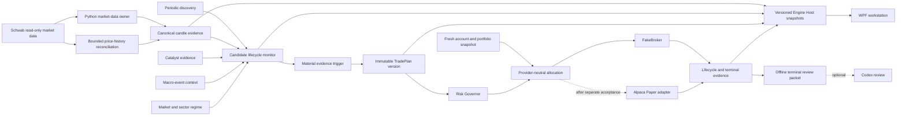

# Continuous Intraday Market Awareness Architecture

## Reconciliation Status

This is the current-master reconciliation of the validated architecture first
recorded by `013cafd` and closed on source branch head `bae053b`. The source
branch remains preserved. This version updates implementation status and
provider boundaries without importing that branch's stale Roadmap or governance
files.

Source lineage:

| Source artifact | SHA-256 |
| --- | --- |
| `architecture/CONTINUOUS_INTRADAY_MARKET_AWARENESS.md` | `D3D7CAB0081A7B9157777B664BB2779E980BE4AB0D2DFF386F4F17BEA477820D` |
| `task-contracts/CONTINUOUS_INTRADAY_IMPLEMENTATION_SEQUENCE.md` | `8E0BD2A683B9B192D1B017D79BCAB6D676BD66A2E854159308EBD0C11E68C30B` |
| `task-contracts/ARGUS-R031B-live-candle-proof-adjudication.md` | `3B36A7CDEF94A2D98A105BB3001A8FF8F9B80517683C5DE321CABA48AB47ABD9` |
| `goal-charters/ARGUS-ROADMAP-002-continuous-intraday-awareness.md` | `35DABDD00A61F29572C881FB068A54BCD5F016293110263F3817D370F350C78C` |
| `reports/releases/ARGUS-ROADMAP-002-continuous-intraday-awareness.md` | `2498E99583A5B67E6A822B2482E61B7569F5AC6AB3060603358B5FE3A65F8BE1` |

The opening capture at 08:35 Central remains an immutable bootstrap and
operational evidence checkpoint. It is not the sole discovery window,
monitoring cycle, plan creation point, or opportunity window. Continuous
operation maintains a bounded watch set, consumes versioned evidence, reacts
only to material change, creates immutable setup/plan identities, and preserves
every blocked or terminal result.

This architecture grants no live-order authority. Schwab is the proven
read-only market-data and account-evidence source. Alpaca Paper is a separate,
still-gated execution-research provider. FakeBroker remains the only canonical
automated execution boundary until the Paper stack passes its own acceptance
and integration gates. Live Alpaca and unattended-live execution remain
unauthorized.

## Current Capability Truth

| Capability | Current state on 2026-08-09 | Remaining boundary |
| --- | --- | --- |
| Opening bootstrap | Canonical unattended 08:35 capture; 25 future jobs pinned to `1d0ca95` | Keep immutable and operationally isolated from feature work |
| Schwab candle proof | R031B complete and accepted with limitations | Stream volume/finality never becomes canonical without reconciliation |
| Candle persistence | R032 canonical with source lineage, corrections, gaps, stale states, and single-writer protection | Bounded universe; no execution authority |
| Historical depth | R032B and R032C canonical for bounded minute/Daily backfill and cache-first loading | Provider limits and unavailable states remain explicit |
| WPF charts | R033 canonical with Engine Host snapshots, deterministic 5m/15m aggregation, dense display, and truthful gaps/staleness | WPF remains provider-free and non-authoritative |
| Relative volume | DATA-002 canonical and time-normalized from complete Schwab minute windows | Insufficient baseline/current bars fail closed |
| Setup identity | DATA-003 canonical; breakout and reclaim are distinct | No missed setup may be silently rewritten |
| Intraday plan horizon | DATA-004 canonical for opening, continuation, pullback, reclaim, and authority-proven catalyst setup families | Later-session producers still need continuous monitoring |
| Account allocation | DATA-005 and DATA-005A canonical with fresh account/portfolio evidence | Provider quantization and numeric policy activation remain gated |
| Candidate lifecycle | MONITOR-001 validated at `d2b77c2`, dormant and unmerged | Serialized integration and runtime pin window |
| Market regime | REGIME-001 validated at `f4deb18`, dormant and unmerged | Integrate after MONITOR; no silent score authority |
| Macro event context | EVENT-001 validated at `b6e861a`, dormant and unmerged | Source/policy activation remains separate |
| Catalyst revisions | CATALYST-002A validated at `97ab34d`, dormant and unmerged | Live provider intake remains CATALYST-002B gated |
| Sequential breakouts | Historical research primitives exist; BREAKOUT-001 is Ready | Capture remains research-only |
| Official Shadow | Historical v1/v2/v3 preserved; current sample unarmed at `0 / 30` | New sample waits for the continuous authority chain |
| Alpaca Paper | A001/A002/A003 branch stack validated and pushed; direct A003 lifecycle acceptance waits for market hours | Stack remains unmerged; no activation or live endpoint authority |

## Target Runtime Shape



WPF and Codex have no direct provider, selection, Risk Governor, allocation, or
lifecycle-mutation path. Paper execution is not a mode toggle on the Schwab
market-data path. Any future live adapter is a separate CEO-authorized project.

## Ownership And Source Rules

1. Python owns provider sessions, market evidence, decisions, persistence, and
   execution-research state. WPF consumes versioned snapshots.
2. Each evidence field retains provider time, local receipt time, source,
   sufficiency, freshness, and immutable fingerprint.
3. Price history is authoritative for completed canonical OHLCV reconciliation;
   Streamer arrivals retain their own versions and cannot silently overwrite it.
4. Duplicate, out-of-order, correction, gap, halt, stale, and reconnect evidence
   remain explicit. Missing evidence is never fabricated.
5. Account and portfolio reads use the exact approved binding and fail closed on
   account-count, ending, type, hash, permission, position, or scope anomalies.
6. Broker capability, account policy, and strategy intent remain separate.
   `idealRiskQuantity`, `providerExecutableQuantity`, and
   `finalAuthorizedQuantity` are preserved independently.
7. Canary-realistic and strategy-research Paper results use distinct identities
   and statistics. Neither may rewrite historical FakeBroker or Shadow evidence.

## Discovery And Monitoring

Discovery finds or refreshes candidates from a broad bounded universe.
Monitoring tracks a smaller watch set continuously. Discovery cannot create an
order, mutate an active setup, or remove a safety-critical symbol. Monitoring
cannot manufacture a decision for a period when evidence was unavailable.

The bounded watch universe may include Hunter candidates, saved symbols,
catalyst/earnings candidates, symbols near important levels, selected or
near-trigger symbols, active FakeBroker/Paper research positions, SPY, IWM, and
required sector ETFs. Capacity and eviction are versioned policy, not guessed
provider facts.

Reevaluation occurs only after a material evidence change. Ordinary duplicate
quotes or repeated unchanged bars update availability/display state but do not
create a new decision cycle.

## Candidate Lifecycle

Required lifecycle states include:

- `DISCOVERED`
- `WATCHING`
- `IMPULSE_DETECTED`
- `BREAKOUT_FORMING`
- `BREAKOUT_CONFIRMED`
- `PULLBACK_FORMING`
- `RECLAIM_FORMING`
- `EXECUTION_ELIGIBLE`
- `ENTRY_MISSED`
- `EXHAUSTION_RISK`
- `FAILED_BREAKOUT`
- `INVALIDATED`
- `COOLDOWN`
- `DATA_STALE`

Every transition records prior/next state, trigger/event identity, evidence
fingerprint, provider and receipt clocks, and reason. `DATA_STALE` blocks new
eligibility. Recovery requires source revalidation and gap disposition. A
breakout, pullback, and reclaim are separate setup identities; failure or miss
cannot be renamed in place.

Identity contract:

```text
Opportunity ID = symbol + session + originating evidence family
Setup ID       = opportunity ID + setup family + setup sequence
Plan ID        = setup ID + immutable plan version + evidence fingerprint
Decision ID    = plan ID + risk/allocation fingerprint + decision clock
```

Exact evidence repeats are idempotent. Cooldowns suppress oscillation, not
safety, stale, halt, stop, active-position, or terminal events.

## Material Event Matrix

| Event | State effect | Decision authority |
| --- | --- | --- |
| Opening bootstrap | Seed or refresh watch set | Only materially changed eligible rows |
| Periodic discovery | Add or refresh candidates | After dedupe and evidence delta |
| Completed canonical minute | Update setup, RVOL, and regime evidence | Near-trigger/active setup only |
| In-progress minute | Display/provisional update | None by default |
| Fresh quote | Spread and active-position mark | Safety/lifecycle only unless setup contract says otherwise |
| Breakout/failure/pullback/reclaim | New legal lifecycle transition | Requires complete setup evidence |
| Catalyst revision | Update attribution/authority | Only on material authority change |
| Regime or event-window change | Bounded affected-set reevaluation | Only under frozen prospective policy |
| Disconnect/gap/stale source | Mark unavailable or stale | New entry blocked |
| Operator pin/watch | Display/watch reference | No automatic eligibility |

## TradePlan And Allocation Contract

1. TradePlans are immutable after creation.
2. `OPENING_BREAKOUT`, `CONTINUATION_BREAKOUT`, `PULLBACK`, `RECLAIM`, and
   authority-proven catalyst setups are explicit same-session families.
3. Every plan binds setup identity, evidence fingerprint, source clocks, entry,
   stop, targets, horizon, expiry, forced-flat behavior, invalidation,
   configuration identity, and predecessor/supersession identity.
4. A material revision creates a new plan. Historical eligibility and decisions
   remain queryable.
5. Risk Governor evaluates the exact plan version. Provider-neutral allocation
   then evaluates one fresh frozen account/portfolio snapshot for the cycle.
6. A manual override creates a new plan version and forces a new Risk Governor
   and allocation result.
7. Insufficient buying power, stale account evidence, unsupported fractional
   capability, concurrency, aggregate risk, or daily-loss state produces an
   explicit no-trade result, never an inferred quantity.

## Research And Context Contracts

- **Regime:** versioned benchmark/sector inputs, sufficiency, stale state, prior
  state, and transition reason. It is context or a gate, never hidden score.
- **Macro events:** sourced and revisioned calendar evidence may yield normal,
  caution, block-new-entry, or unavailable context. An event never initiates a
  trade.
- **Catalysts:** immutable revisions, canonical-source/content deduplication,
  explicit attribution, authority, freshness, and outage recovery. Unresolved
  relationships remain research-only.
- **Breakouts:** sequential impulse, breakout, miss, failure, pullback, reclaim,
  and exhaustion evidence remains research-only until a later authority task.
  No-lookahead event clocks and unavailable-data states are mandatory.

## Failure And Recovery Principles

- Provider, authentication, entitlement, clock, acknowledgement, gap, account,
  and broker-capability failures are separate states.
- Stale or contradictory required evidence blocks new decisions.
- Historical repair improves chart/research continuity; it does not create a
  retroactive decision or trade.
- A discovery outage retains the valid watch set with reduced freshness. A
  monitoring outage cannot be backfilled as though live decisions occurred.
- Reconnect and restart revalidate leases, hashes, identities, and terminal
  state before resuming.
- No Paper proof, UI label, or review packet may imply live-order authority.

## Remaining Program Work

The current dependency truth is maintained in
[CONTINUOUS_INTRADAY_IMPLEMENTATION_SEQUENCE.md](../task-contracts/CONTINUOUS_INTRADAY_IMPLEMENTATION_SEQUENCE.md)
and the authoritative [ROADMAP.md](../ROADMAP.md). The immediate continuous
program gaps are serialized integration of validated MONITOR/REGIME/EVENT/
CATALYST work, BREAKOUT-001 research capture, provider/policy proof for live
catalyst and macro inputs, PLAN-002 continuous plan production, accepted Alpaca
Paper lifecycle/allocation integration, and a new prospective Shadow identity.

R034 legacy deletion remains a separate destructive approval gate. It does not
block the non-destructive continuous architecture work above.
