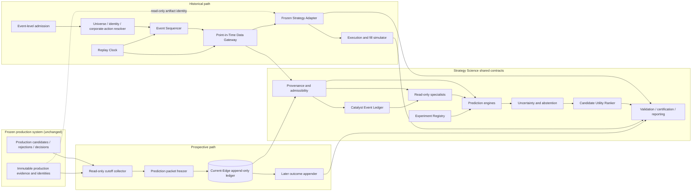

# ARGUS-STRATEGY-SCIENCE-LAB-001 Review Packet

Date: 2026-08-29
Branch: `codex/argus-strategy-science-lab-001`
Directive: `ARGUS-DIRECTIVE-STRATEGY-SCIENCE-LAB-001`
Classification: `RESEARCH_ARCHITECTURE_REVIEW_ONLY`
Production authority: `NONE`
Execution authority: `EXECUTION_AUTHORITY_NONE`

## Executive conclusion

**Decision: GO for the Strategy Science architecture and a separately authorized,
read-only Current-Edge Research Ledger slice; NEEDS_DATA for admitted historical
alpha research; NO-GO for production strategy influence or advanced-model
promotion.**

Argus should establish one research subsystem with two evidence directions:

1. prospective evidence is frozen now and revealed later through the Current-Edge
   Research Ledger; and
2. admitted historical evidence is revealed sequentially through a reusable
   Point-in-Time Market Replay kernel (the Time Machine).

Both paths converge on the same provenance, prediction-object, experiment, and
evaluation contracts. Neither path changes production candidate generation,
scores, rankings, TradePlans, risk, sizing, exits, Paper, Shadow, brokers, orders,
the GUI, or canonical production policy.

The architecture is implementable, but the historical evidence is not yet ready.
Current broad datasets have unknown price basis, ticker-only identity,
uncontrolled survivorship, incomplete rejected-candidate denominators, and no
event-level corporate-action lineage. Therefore no broad longitudinal result can
be called admitted merely because the replay software exists. The reusable kernel
may be designed and tested with fixtures while real events continue to fail
closed at admission.

The simplest adequate research ladder begins with deterministic and interpretable
baselines. Advanced GNN, foundation-model, autonomous-agent, bandit, and RL work
remains gated until a simpler model exposes a specific unresolved deficiency and
the complex challenger earns incremental out-of-sample executable value.

## Packet map and deliverable coverage

This packet is the controlling architecture and validation design. Companion
artifacts are:

- [Goal Charter](../../goal-charters/ARGUS-STRATEGY-SCIENCE-LAB-001.md)
- [Repository inventory and reuse matrix](ARGUS-STRATEGY-SCIENCE-LAB-001-inventory.md)
- [Research evidence and model decision matrix](ARGUS-STRATEGY-SCIENCE-LAB-001-research-matrix.md)
- independent second-eye review, produced after these artifacts are frozen

Together they cover the directive's 36 deliverables. This document owns the
executive conclusion, architecture, contracts, schemas, threat models,
procedures, validation, preregistrations, source/cost design, roadmap,
dependencies, gates, rejected/deferred ideas, and next directive. The companion
inventory owns current-state proof; the companion research matrix owns the
30-family scientific evidence and per-family decision.

| Deliverable | Authoritative location |
|---|---|
| D01 Executive conclusion | `Executive conclusion` |
| D02 Current-state inventory | [companion inventory](ARGUS-STRATEGY-SCIENCE-LAB-001-inventory.md), `Section II inventory: all twenty items` |
| D03 Existing-infrastructure reuse matrix | [companion inventory](ARGUS-STRATEGY-SCIENCE-LAB-001-inventory.md), `Recommended architecture boundary`, plus `Existing ownership and non-duplication decisions` here |
| D04 Research evidence matrix | [companion research matrix](ARGUS-STRATEGY-SCIENCE-LAB-001-research-matrix.md), `Evidence matrix A-D` |
| D05 Source-quality classifications | [companion research matrix](ARGUS-STRATEGY-SCIENCE-LAB-001-research-matrix.md), `Source-quality classification` |
| D06 Proposed architecture diagram | `Architecture` |
| D07 Logical component contracts | `Logical component contracts`, including the A-J table |
| D08 Point-in-time data contract | `Point-in-time data contract` |
| D09 Provenance schema | `Provenance schema` |
| D10 Current-Edge Research Ledger design | `Current-Edge Research Ledger design` |
| D11 Catalyst Event Ledger design | `Catalyst Event Ledger design` |
| D12 Prediction-object definitions | `Prediction objects` |
| D13 Candidate Utility Ranker design | `Candidate Utility Ranker` |
| D14 Model ladder | `Model ladder and promotion` |
| D15 Complexity-promotion gates | `Model ladder and promotion` |
| D16 Specialist decomposition | `Specialist decomposition` |
| D17 Anti-lookahead threat model | `Threat models / Anti-lookahead` |
| D18 LLM historical-contamination threat model | `Threat models / Historical LLM contamination` |
| D19 Survivorship/universe threat model | `Threat models / Survivorship and universe` |
| D20 Execution/cost/capacity model | `Execution, cost, and capacity model` |
| D21 Golden-day certification procedure | `Golden-day replay certification` |
| D22 Frozen-baseline replay procedure | `Frozen-baseline longitudinal replay` |
| D23 Statistical-validation protocol | `Statistical validation protocol` |
| D24 Multiple-testing protocol | `Multiple-testing and search protocol` |
| D25 Prospective-shadow protocol | `Prospective shadow protocol` |
| D26 Five preregistered hypotheses | `Five preregistered hypothesis specifications` |
| D27 Data-source inventory | `Data-source, licensing, cost, and gap inventory` |
| D28 Licensing constraints | `Data-source, licensing, cost, and gap inventory` |
| D29 Data costs | `Data-source, licensing, cost, and gap inventory` |
| D30 Data coverage gaps | `Proven coverage gaps` |
| D31 Proposed revised roadmap | `Revised roadmap proposal` |
| D32 Dependencies | `Dependencies and acceptance gates` |
| D33 Acceptance gates | `Dependencies and acceptance gates` |
| D34 Model-family decisions | [companion research matrix](ARGUS-STRATEGY-SCIENCE-LAB-001-research-matrix.md), `Decision` column |
| D35 Rejected/deferred attractive ideas | `Attractive ideas explicitly rejected or deferred` |
| D36 Exact next implementation directive | `Proposed exact next implementation directive` |

## Frozen boundary

Permitted here:

- research, architecture, inventory, threat modeling, validation design, and a
  proposed dependency-aware roadmap;
- read-only repository and public-source inspection;
- documentation and review artifacts.

Not permitted here:

- source code, tests, packages, database/schema/migration, generated operational
  data, service, scheduler, provider, credential, broker, order, Paper, Shadow,
  GUI, strategy, scoring, ranking, TradePlan, allocation, risk, sizing, stop,
  target, or exit changes;
- provider procurement, a paid commitment, live API calls, runtime activation,
  historical model fitting, or production promotion;
- rewriting an existing prediction, outcome, trade, experiment, or prospective
  evidence packet.

## Architecture

Formal names are preserved as follows: `Argus Strategy Science Lab` is the
parent research subsystem; `Argus Point-in-Time Market Replay Engine` (the Time
Machine) is its reusable historical kernel; `Argus Current-Edge Research Ledger`
is its prospective freeze/reveal evidence lane; `Argus Catalyst Asymmetry Engine`
(Catalyst Radar) is a future composition of the event, outcome, expectation,
reaction, relationship, text, uncertainty, tradeability and policy roles below;
and `Argus Candidate Utility Ranker` is the separate downstream decision object.
Catalyst Radar is not a service, store, current model, or authority created by
this packet.



The Frozen Strategy Adapter is outside the production trust boundary. It loads
an exact, content-identified strategy/code/configuration artifact in an isolated
offline replay process and replaces its clock and data dependencies with the
Replay Clock and PIT Gateway. It cannot import into, call, or write to the
running production process. The Current-Edge collector observes immutable
production outputs; it cannot feed them or become a production dependency.

### Deployment decision

The components above are logical modules, not services. Initial implementation
must be an in-process, standard-library-friendly vertical slice with explicit
caller-supplied storage roots. No message queue, new database, daemon, service,
or distributed scheduler is justified. A later ADR may split a component only
after measured operational evidence proves that an in-process boundary cannot
meet isolation, volume, latency, or ownership requirements.

### Existing ownership and non-duplication decisions

| Existing boundary | Strategy Science use | Non-duplication rule |
|---|---|---|
| Production candidates, rejections, TradePlans, evidence and identity | Read immutable records by exact ID/fingerprint | The Lab never republishes an editable production object or becomes its owner |
| STAT-DATA-001 opportunity denominator and market-path/broker attachments | Reuse stable opportunity identity and canonical outcome references when available | A Current-Edge packet is a freeze manifest plus Lab-owned predictions; it is not a second opportunity or broker-outcome system |
| RESEARCH-DATA-002 identity/action/price-basis admission | Compose into Universe Resolver and Corporate-Action Transformer | The Lab adds no competing security ID, alias, action, or price-basis semantics |
| SPECIALIST-CONTRACT-001 `SpecialistOpinion` v1 | Reuse unchanged as the common authority/target/evidence envelope | Rich distributions remain specialist-owned payloads or a later explicitly versioned contract; this packet does not silently revise v1 |
| RESEARCH-GOV-001 experiment registry | Reuse experiment, feature, dataset, partition, variant, holdout and receipt identities | The Lab does not create a second experiment registry or winner-only result history |
| Integrated REGIME-001 / CONTINUOUS-003 foundation and dormant ARGUS-REGIME-002 extension | Reuse raw continuous features as context and evaluate discrete labels only as a challenger | The directive's REGIME-001 step does not authorize a duplicate regime engine or promote existing heuristic labels |
| Existing catalyst evidence/headline/age primitives plus ARGUS-CATALYST-MEMORY-001 / EVENT-SHOCK-001 boundaries | Extend the point-in-time revision, duplicate, freshness and event-relationship semantics into the Catalyst Event Ledger contract | No sibling mutable catalyst store, relationship authority, or duplicate headline scoring path is authorized |
| FakeBroker, BrokerAdapter and Simulation Lab boundaries | Adapt proven pure simulation/execution semantics where the inventory positively admits them | The research Fill Simulator never becomes a broker, provider, account, or order interface; missing effects stay modeled/unknown |
| ARGUS-TRADE-REPLAY-001 | Named failure-boundary and fixed-entry consumer of the reusable replay kernel | It is not replaced by, and cannot become a competing Time Machine implementation |

## Logical component contracts

| Component | Inputs | Outputs | Fail-closed rule | Authority / state owner |
|---|---|---|---|---|
| Cutoff Collector | Explicit cutoff, eligible universe, production evidence references, identities | Unfrozen packet proposal | Missing cutoff, identity, evidence chronology, or required negative evidence rejects capture | Read-only observer; owns no production state |
| Packet Freezer | Complete packet proposal | Canonical immutable prediction packet and receipt | Outcome-populated fields, mutable references, noncanonical bytes, duplicate logical identity with different bytes, or incomplete identity reject | Owns write-once research packet only |
| Outcome Appender | Frozen packet ID, outcome cutoff, admitted outcome evidence or canonical outcome attachment IDs | Separate immutable reveal manifest and Lab-derived evaluations | Cannot update prediction bytes; early, unsupported, or owner-conflicting outcome rejects | Owns only the packet-to-reveal association, never canonical market-path/broker truth |
| Catalyst Event Ledger | Evidence envelope and prior event version | New event or state-transition version | No transition without source, first-known time, valid time, retrieval time, and transition reason | Owns research event versions, never a production catalyst |
| Replay Clock | Certified scenario start and ordered advance batches | Current simulated UTC instant and monotonic batch sequence | Wall clock unavailable to replayed strategy; backward or conflicting sequence rejects; equal-time evidence is batched | Sole simulated-time authority |
| PIT Data Gateway | Replay time, typed query, source/version/admission/availability policy | Evidence envelopes available at that instant or explicit unavailable result | Any unproven availability, future revision, ambiguous identity, or basis-sensitive unresolved action rejects | Only historical-data boundary exposed to strategy |
| Universe Resolver | Replay time, security master, membership and action evidence | Eligible securities with stable IDs and historical aliases | Current-only list, guessed ticker mapping, or missing inactive/delisted coverage cannot claim controlled universe | Owns research identity mapping only |
| Event Sequencer | Admitted envelopes | Deterministic time-ordered batches | Order batches by `available_at`; use source sequence only when proven; unresolved material same-time order is explicit ambiguity | Owns replay delivery order |
| Frozen Strategy Adapter | Content-identified strategy/code/configuration artifact, replay clock and PIT interfaces | Offline decisions plus attempted-access receipt | Any wall-clock, network, current-cache, production-process, or unbound dependency access invalidates the run | Research process only; owns no strategy or production state |
| Corporate-Action Transformer | Raw series, verified action chain, target basis | Derived series plus transformation lineage | Unknown basis or unsupported/unverified action blocks basis-sensitive use | Reuses DATA-CORPACTION / RESEARCH-DATA-002 contracts |
| Execution / Fill Simulator | Orders emitted by frozen offline strategy, contemporaneous quotes/depth, assumptions ID | Fill/reject/cancel/ambiguity events | A stop request is not a fill; unavailable chronology becomes ambiguity, never favorable inference | Offline simulation only |
| Feature Provenance Store | Admitted evidence and versioned transformation | Immutable feature records | Feature without demonstrable first-known and availability times is non-admissible | Research features only |
| Specialist Adapter | Frozen features and Specialist Contract identity | Opinion packet | Stale/mismatched evidence, prohibited object, unsupported confidence semantics, or expiry forces abstention | `RESEARCH_ONLY`; cannot place/veto an order |
| Prediction Engines | Named prediction object, admitted features, model identity | Probabilities, quantiles, distributions, or survival objects | Binary action label cannot substitute for required intermediate objects | Prediction only |
| Uncertainty / Abstention | Predictions, coverage, disagreement, OOD and calibration state | Separated uncertainties and abstention decision | Missing calibration or material evidence conflict may mandate abstention | Research advice only |
| Candidate Utility Ranker | Preserved distributions, execution/cost model, portfolio context | Per-action utility decomposition and ranking | Cannot collapse unknown inputs into favorable defaults; zero actions is valid | No production ranking authority |
| Experiment Registry | Frozen preregistration, variants, holdout receipts, results | Complete immutable research search history | Deleted failures, undeclared search expansion, holdout contamination, or fingerprint break invalidates claim | Reuse RESEARCH-GOV-001 |
| Certification / Reporter | Replay/prospective evidence and registered protocol | Discrepancy, metric, robustness, and decision reports | No hidden normalization; every discrepancy and failed variant remains visible | Reporting only |

The Event Sequencer orders batches by `available_at`. A source-proven sequence
may order events inside a batch; otherwise equal-resolution events are delivered
as one atomic batch and no decision may be inserted between them. `envelope_id`
is a canonical serialization tie-breaker only, never evidence that one event was
knowable before another. Unresolved causal ordering that matters to a decision
produces an explicit ambiguity and blocks certification.

### Directive logical engines A-J

These are logical research roles composed from the shared contracts above, not
new services or production components.

| Engine | Inputs / clock and identity | Output | Failure / abstention | Prohibited authority |
|---|---|---|---|---|
| A. Event State / Timing | PIT event evidence at Replay Clock; event/version/source identities | Event family, versioned state, exact time or uncertainty window, source quality | Missing chronology or conflicting state fails; incomplete timing abstains or remains `WINDOWED` | No candidate, score, or schedule authority |
| B. Outcome / Surprise | Admitted event/fundamental/scientific/regulatory evidence; model/calibration identity | Separate outcome probability/distribution and surprise versus a named expectation snapshot | Missing expectation forbids a surprise claim; OOD or uncalibrated probability abstains | Cannot turn probable success into a trade action |
| C. Expectation / Positioning | PIT estimates/revisions, valuation, repricing, options, positioning and peer/sector context | Contemporaneous expectation distribution and explicit divergence/probability gap | Unknown vintage, inversion assumption, or source disagreement remains visible and may abstain | No reaction or order authority |
| D. Reaction Distribution | Outcome/expectation objects plus PIT market context; horizon/label identity | Gap, open-close, multi-horizon, MFE/MAE, competing-risk, timeout and expected-shortfall distributions | Censoring and ambiguous path stay explicit; missing gap/tail evidence abstains | No binary direction may replace the distribution |
| E. Relationship Propagation | Versioned PIT edges, source event and target identities | Transparent market/sector/ETF-adjusted remaining-propagation estimate | Unknown/future/stale edge rejects or abstains; placebo success blocks claim | No inferred edge, GNN, or duplicate catalyst scoring authority |
| F. Text Evidence | Admitted source bytes, retrieval path/time, prompt/model/tool identity | Cited typed facts, statements, opinions, hypotheses, contradictions and unavailable fields | Missing citation/provenance fails; contaminated retrospective LLM output is non-admissible | Narrative cannot authorize a trade |
| G. Uncertainty / Abstention | Prediction objects, calibration, coverage, disagreement, OOD, timing and conflicts | Separated uncertainty vector plus mandatory/optional abstention and reasons | Unknown calibration never becomes confidence; material conflicts can force abstention | Cannot manufacture coverage or override a fail-closed source |
| H. Tradeability / Fill | Contemporaneous quotes/depth/volume/status, order semantics and simulation identity | Fill/reject/cancel/partial-fill/latency/cost distributions | Unavailable depth is not infinite; uncertain chronology stays ambiguous; stop request is not a fill | Simulation only; no broker/account/order capability |
| I. Candidate Utility Ranker | Preserved prediction/fill distributions, portfolio/risk/cash context and policy identity | Per-action decomposed executable utility, top-K rank and zero-action result | Unknown required input cannot receive a favorable default; nonpositive/unsafe actions reject or abstain | No production ranking, sizing, Risk Governor, or TradePlan authority |
| J. Scout / Confirm / Scale Policy | Explicit action set, frozen state transitions, fill evidence and scale-independent risk identity | Counterfactual action-policy value and transition record | Unsupported action, hidden leverage, post-cutoff confirmation, or off-policy support gap invalidates comparison | No position mutation; full RL remains deferred |

## Point-in-time data contract

### Time semantics

Every evidence envelope carries distinct clocks:

- `valid_time`: when the fact applies in the modeled world;
- `publication_time`: source-declared public release time, if known;
- `source_received_time`: when the upstream feed made it available, if proven;
- `retrieval_time`: when Argus obtained the exact bytes;
- `first_known_time`: earliest time Argus can defensibly prove this exact fact or
  version was knowable;
- `recorded_time`: when Argus froze the envelope;
- `superseded_time`: optional time a later version replaced it for current-state
  views, never a deletion time.

Each run binds an `availability_policy_id`. For recorded prospective evidence,
`available_at` is at least the maximum of every availability constraint required
by that policy, including actual receipt/retrieval when the frozen strategy
depended on it. For reconstructed history, modern retrieval time is retained but
does not pretend the fact was unavailable historically; `available_at` is instead
the most conservative defensible historical public/feed availability plus any
registered dissemination delay. Such evidence stays `RECONSTRUCTED` and may be
used only under a policy that expressly admits it. If a policy-required element
or historical availability proof is unknown, the gateway returns a typed
unavailable result. Valid time alone never establishes knowledge time.
An exact-production baseline additionally requires proof that reconstructed
values were obtainable through, or are pre-accepted as equivalent to, the
strategy's then-authorized input boundary. A convenient later vendor substitute
is otherwise a separate counterfactual run, not exact baseline reproduction.

### Evidence classes

| Class | Meaning | Admitted use |
|---|---|---|
| `RECORDED` | Exact contemporaneously captured bytes with verified identity and timestamps | Eligible when all admission checks pass |
| `DERIVED` | Deterministic transformation of admitted inputs | Eligible with complete input and transformation lineage |
| `RECONSTRUCTED` | Later reconstruction from historical sources | Eligible only for specifically reviewed objects and conservative availability; never silently equivalent to recorded |
| `SYNTHETIC` | Fixture or generated evidence | Software validation and negative controls only |
| `UNAVAILABLE` | Required evidence absent or not defensibly knowable | Forces missingness/abstention; never imputed as favorable fact |

Admissibility is separately classified as `ADMITTED`, `CONDITIONAL`,
`EXPLORATORY_NON_ADMISSIBLE`, or `REJECTED`. Evidence class and admissibility
must not be conflated.

### Canonical evidence envelope

```json
{
  "contract": "argus-pit-evidence-v1",
  "envelope_id": "content-derived",
  "entity_id": "stable research identity",
  "security_id": "nullable",
  "event_id": "nullable",
  "evidence_type": "typed enum",
  "evidence_class": "RECORDED|DERIVED|RECONSTRUCTED|SYNTHETIC|UNAVAILABLE",
  "admissibility": "ADMITTED|CONDITIONAL|EXPLORATORY_NON_ADMISSIBLE|REJECTED",
  "valid_time": "interval or instant",
  "publication_time": "nullable UTC instant",
  "source_received_time": "nullable UTC instant",
  "retrieval_time": "UTC instant",
  "first_known_time": "UTC instant",
  "available_at": "UTC instant or UNKNOWN",
  "availability_policy_id": "content-identified policy",
  "recorded_time": "UTC instant",
  "source": {"provider": "name", "locator": "stable reference", "fingerprint": "sha256"},
  "payload_fingerprint": "sha256",
  "version": "source and transformation version",
  "supersedes": "nullable envelope_id",
  "missingness_reason": "nullable typed code",
  "confidence": "source/verification confidence, not trade confidence"
}
```

Canonical JSON uses sorted keys, strict UTC, finite numerics, bounded collections,
duplicate-key rejection, and whole-record fingerprints. Raw source evidence is
never overwritten by a derived representation.

### Gateway query rules

1. The query supplies replay time, security/entity identity, typed data object,
   horizon, basis requirement, and admission/availability policy identities.
2. Identity resolves at replay time; ambiguous or unresolved aliases fail.
3. Candidate versions must have `available_at <= replay_time`.
4. A version revised after replay time cannot replace the then-current version.
5. Corporate-action-sensitive queries require verified basis and action lineage.
6. Universe queries include inactive, renamed, acquired, bankrupt, and delisted
   securities when historically eligible.
7. The gateway returns payload plus evidence envelope; it never returns an
   unproven value without its missingness/admissibility state.
8. Every query and denial is logged in the replay receipt so attempted future
   access is observable.

Gateway results distinguish ordinary missing evidence from run-invalidating
integrity failures:

- `AVAILABLE` returns one admitted value and its envelope;
- `UNAVAILABLE` returns no value plus a typed reason and normally propagates to
  feature missingness and abstention;
- `DENIED_FUTURE` records an attempted post-clock access and invalidates
  certification of the run even if caller code catches it;
- `AMBIGUOUS_IDENTITY_OR_BASIS` blocks the affected object and every dependent
  basis-sensitive claim;
- `INVALID_EVIDENCE` (tamper, contradictory chronology, fingerprint failure,
  duplicate conflict, or policy mismatch) terminates the run.

The gateway's typed object surface eventually covers candles; trades, quotes,
bid/ask, volume and depth; analyst estimates and revisions; options; SEC filings;
earnings releases and conference calls; news; FDA and ClinicalTrials evidence;
economic releases; company relationships; and index/sector membership. A named
object is not implemented or admitted merely because it appears in this design.
Each adapter must define its source-version, timestamp-resolution, revision,
missingness and licensing policy before returning `AVAILABLE`.

Every replay starts from one immutable run manifest binding source-data snapshot,
code, frozen strategy, model/calibration, configuration, feature definitions,
prompts/tools where applicable, admission/availability policy, universe,
corporate-action transformation, clock/event-order policy, execution/cost
assumptions and output schema. A missing or changed identity creates a different
run; it cannot resume or compare as the same replay.

## Provenance schema

Each research feature record adds to the envelope:

```text
feature_name, feature_version, value, value_type, units,
entity_id, security_id, event_id, horizon, valid_time, first_known_time,
publication_time, retrieval_time, ordered_input_envelope_ids,
transformation_name, transformation_version, code_identity,
corporate_action_status, missingness_reason, evidence_coverage,
confidence_semantics, admissibility, feature_fingerprint
```

Feature identity changes when any input, time, value, transformation, basis,
code, or admissibility changes. Imputation is a transformation with its own
indicator and cannot erase the original missingness reason.

## Current-Edge Research Ledger design

### Prediction packet

The frozen packet is a write-once canonical record containing:

- packet/cutoff/sample/experiment identity;
- eligible universe and complete admission/rejection set;
- known exact and windowed events plus Catalyst Event versions;
- ordered evidence-envelope references and coverage summary;
- contemporaneous prices, candles, spread/liquidity, analyst and options state;
- exact production candidates, rejections, decisions, scores/ranks and
  TradePlan references as observations, not editable copies;
- research feature records;
- baseline and challenger predictions by named prediction object;
- missingness, uncertainty, disagreement, OOD, and abstention state;
- model, calibration, prompt, code, configuration, strategy, feature-definition,
  source-data, simulation-assumption, and human-intervention identities;
- `outcome_state = UNREVEALED` and no populated outcome value.

The freezer rejects a packet if an outcome field is populated; any referenced
evidence, decision, feature or prediction was not available by the cutoff; the
prediction/freeze chronology is non-monotonic or after the earliest outcome
availability; or a required source/model/prompt/code/configuration identity is
incomplete. A registered capture-lag policy distinguishes the evidence cutoff
from local serialization time without allowing intervening information into the
packet.

### Reveal packet

Outcomes are exposed through a separate reveal record keyed to the prediction
packet. It carries the outcome horizon/cutoff, admitted outcome evidence,
fill/cost assumption identity, realized and censored evaluations, ambiguity, and
a fingerprint. Where STAT-DATA-001 market-path or broker attachments already own
the outcome, the reveal record references their immutable IDs and fingerprints;
it does not restate or supersede them. Lab-specific derived labels bind their
inputs and transformation identity. Multiple horizons append multiple records.
The original packet remains byte-identical.

### Storage and receipt behavior

The first slice should use a caller-supplied absolute research root and immutable
files, reusing the experiment registry's canonical/write-once patterns. It must
have no default production path and no database migration. Exact duplicate bytes
are idempotent; conflicting bytes for one logical identity fail. A receipt binds
the file fingerprint, previous receipt, cutoff, code/configuration identity, and
terminal write result. Readers validate the full chain before returning a sample.

Core invariant: **PREDICT FIRST. FREEZE. REVEAL LATER.**

## Catalyst Event Ledger design

A catalyst is a durable event, not a headline. Each event has immutable versions:

```text
event_id, event_family, subject_entity_ids, relationship_edges,
state, timing_kind, exact_time_or_window, timezone, source_evidence,
valid_time, first_known_time, publication_time, retrieval_time,
transition_reason, prior_version, contradiction_state,
source_quality, confidence, admissibility, version_fingerprint
```

States are `RUMORED`, `ANNOUNCED`, `SCHEDULED`, `WINDOWED`, `IMMINENT`,
`RELEASED`, `DELAYED`, `CANCELLED`, `REVISED`, `RESOLVED`, and `DISPUTED`.
Transitions are append-only and require point-in-time evidence. Exact time is
forbidden when only a window was knowable. Duplicate coverage references an
existing event/version; it does not manufacture independent event strength.

## Prediction objects

| Object | Required output | Explicit separation |
|---|---|---|
| Event existence | Probability event belongs to a defined family | Not event outcome or trade direction |
| Event time | Discrete/continuous time distribution or uncertainty window | Not fabricated exact timestamp |
| Fundamental/scientific/regulatory outcome | Calibrated probability or outcome distribution | Biotech scientific and regulatory objects remain distinct |
| Surprise | Distribution relative to contemporaneous expectation | Actual outcome is not surprise without an expectation baseline |
| Market expectation / positioning | Implied magnitude/probability and uncertainty | Source and inversion assumptions retained |
| Price reaction | Gap, open-to-close, multi-horizon return distributions | Business success is not stock success |
| Path / competing risk | Target-first, loss-first, timeout probabilities and time-to-event | Handles censoring and competing events |
| Tail loss | Quantiles, expected shortfall, skipped-stop/gap/halt scenarios | Stop price is never a loss cap |
| Tradeability | Fill probability, spread, slippage, depth/participation, rejection/latency | Theoretical alpha is not executable alpha |
| Evidence quality | Coverage, conflicts, source quality, missingness, OOD | Not silently folded into prediction |
| Action utility | Per-action expected executable payoff and downside | Separate downstream decision object |

Every object declares horizon, conditioning information, calibration identity,
support, uncertainty, evidence coverage, and abstention state.

## Candidate Utility Ranker

The ranker evaluates each admissible action independently: `IGNORE`, `WATCH`,
`SCOUT`, `ENTER`, `CONFIRM_AND_SCALE`, `REDUCE`, `EXIT`, or `REJECT`. Initial
research uses transparent terms, for example:

```text
expected executable return distribution
- spread, slippage, fees, impact and latency costs
- downside expected-shortfall penalty
- overnight-gap / halt / skipped-stop penalty
- missingness, calibration, OOD and model-disagreement penalties
- incremental portfolio correlation and concentration cost
- capital occupancy and opportunity cost
subject to cash, risk-budget, capability and policy constraints
```

This is not one unexplained score. The record preserves every term, units,
coefficient/policy identity, constraint, reason code, and rejected action. The
ranker produces a sortable tuple led by admissibility and estimated utility, plus
uncertainty and tail risk. If all actions are nonpositive or evidence is
insufficient, it returns zero trade actions.

Scale-independent scout/full/gap/portfolio risk units are inputs. Fixed account
dollars are prohibited. Model outputs cannot change a Risk Governor or position
size under this directive.

### Public-equity judgment record

Every ranked research candidate must answer, in typed fields rather than a
narrative shortcut: what may be mispriced; what contemporaneous expectation is
already priced in; what observable evidence would prove or kill the hypothesis;
why the timing is actionable now rather than eventually; what would change the
hypothetical action; and what evidence is missing. Important inputs remain
labeled as source fact, management statement, consensus, market observation,
model output, assumption, or research judgment. If no defensible variant wedge
exists, the research action is `WATCH`, `PASS`, or `WAIT_FOR_PROOF`, never a
forced trade.

## Specialist decomposition

All specialists reuse the unchanged SPECIALIST-CONTRACT-001 v1 envelope for
authority, target, evidence, as-of/expiry, confidence semantics, abstention and
reason codes. Its strict parser and current identity do not contain or recognize
a rich science payload.

The only permitted v1 extension design is a one-way external adapter record,
`SpecialistSciencePayloadV1`, owned by the specialist research producer. It is
not an unknown field inside v1 and v1 does not claim to reference it. Its
canonical record contains:

```text
payload_contract = specialist-science-payload-v1
payload_id and payload_fingerprint
opinion_id and exact recomputed v1 opinion fingerprint
specialist identity/version
opportunity/candidate/setup/TradePlan target chain copied exactly from v1
as_of and expiry copied exactly from v1
ordered evidence references and evidence-input fingerprint copied exactly from v1
prediction object, probability/distribution, horizon
calibration identity, evidence coverage, uncertainty and abstention state
data version, model version, prohibited interpretation and reason codes
```

Consumers accept a rich pair only after independently parsing and validating the
strict v1 record, recomputing both fingerprints, matching `opinion_id`, v1
fingerprint, specialist, complete target chain, as-of/expiry, and ordered
evidence/input identity, and then validating object-specific probability,
distribution, calibration, coverage and prohibited-use rules. Missing payload is
valid v1-only advice. Missing v1, mismatch, expiry, duplicate payload identity
with different bytes, or more than one terminal payload for the same
`(opinion_id, payload_contract)` fails closed and the rich object is unavailable.
No payload may broaden v1 authority. If a future design needs the envelope to
bind the payload in both directions, it requires a separately authorized,
versioned Specialist Contract v2 and compatibility proof; this packet does not
silently revise v1 or claim current runtime support.

1. **Earnings Expectation Divergence:** separate business outcome, consensus and
   revision expectation, expected price distribution, and executable economics.
2. **Peer/Customer/Supplier Propagation:** estimate source materiality,
   point-in-time edge confidence, target underreaction, market/sector/ETF
   transmission, and remaining propagation. Begin with transparent weighted
   edges and mandatory sector/ETF/random/stale-edge controls.
3. **Biotech Catalyst Asymmetry:** keep scientific success, regulatory success,
   timing, implied probability, success/failure valuations, runway, dilution,
   gap/halt risk, and executable utility separate.
4. **Post-Catalyst Confirmation:** evaluate observed price, volume, spread,
   liquidity, peer reaction, and cited text for confirmation/contradiction. It
   advises on a hypothetical scale action; it cannot modify a trade.

Regime begins as continuous context (volatility, breadth, liquidity, rates,
yields, index/sector trend, overnight conditions, event density, risk appetite,
and cross-stock correlation). The directive's `REGIME-001` step is reconciled to
the integrated rolling-regime/CONTINUOUS-003 foundation and its already integrated,
dormant `ARGUS-REGIME-002` research extension. Their raw continuous features are
the baseline context; discrete heuristic labels remain research-only unless they
prove incremental value. No new regime owner is created.

## Model ladder and promotion

- **Level 0:** random eligible, event frequency, market/sector return, simple
  momentum, frozen Momentum Hunter, analyst-revision, implied-move, and simple
  peer-propagation baselines.
- **Level 1:** elastic net, logistic, quantile, GAM, hierarchical,
  empirical-Bayes, and interpretable survival/competing-risk models.
- **Level 2:** calibrated gradient boosting and smooth boosted trees.
- **Level 3:** compact ensembles only when members add distinct information.
- **Level 4:** transparent graphs, structured NLP, point-in-time extraction.
- **Level 5:** GNNs, foundation/deep temporal/multimodal models and autonomous
  agents.
- **Level 6:** contextual bandits and supervised policy models.
- **Level 7:** offline RL and advanced sequential control.

No level bypasses earlier evidence gates. A complex model advances only when all
14 conditions below pass under the same admitted data and execution protocol:

1. incremental net economic value after realistic costs;
2. better high-conviction selection or meaningful tail-risk reduction;
3. acceptable probability/distribution calibration;
4. stability across multiple temporal periods;
5. stability across relevant sectors and event classes;
6. no dependence on an unexplained vendor artifact, proven by source/vendor
   substitution where available, vendor-withdrawal and source-family ablation,
   timestamp/missingness-artifact tests, and independent-source replication;
7. a comprehensible account of the distinct information added;
8. successful negative-control testing;
9. successful component and feature ablation;
10. reproducibility from frozen artifacts;
11. acceptable latency;
12. acceptable operational and maintenance complexity;
13. acceptable data, licensing, storage, and inference/compute cost; and
14. no unacceptable increase in production fragility.

Predictive accuracy alone is insufficient. Failure of any one condition leaves
the method at its prior research classification.

The companion research matrix assigns each of the 30 families a roadmap class
and `GO`, `NO-GO`, or `NEEDS_DATA` decision.

## Threat models

### Assets, actors, trust boundaries, and residual risk

Protected research assets are outcome-blank prospective packets; raw source
bytes and source/licensing receipts; time, universe, security, event,
corporate-action and availability identities; the exact frozen strategy/model/
prompt/configuration/code lineage; complete negative denominators and search
history; holdout secrecy; replay-clock/query receipts; execution assumptions;
and immutable reveal/evaluation records.

Failure actors include an accidental future-aware developer or researcher; an
optimizing analyst selecting winners, windows, prompts or variants; a vendor
that revises, deletes, backfills or retimestamps history; a model whose weights
contain the answer; ambient wall-clock/network/cache dependencies; stale or
ambiguous relationship and symbol mappings; corrupted or conflicting files; and
an unauthorized consumer attempting to turn research advice into production
authority. This is a safety/integrity model, not an allegation of malicious
intent.

The principal trust paths are:

```text
source bytes -> evidence envelope -> availability/admission policy -> PIT query
-> feature -> prediction object -> uncertainty -> action utility -> report

production immutable outputs -> read-only collector -> prediction freezer
-> outcome-blank packet -> later reveal manifest -> evaluation

experiment preregistration -> variants/search receipts -> holdout access
-> result -> health/promotion proposal
```

At every arrow, identity, chronology, authority and missingness must propagate;
loss or substitution fails closed. The production-to-collector boundary is
one-way. The offline strategy boundary denies wall clock, network, current cache,
production process and unbound files. The reveal boundary cannot reach backward
into the prediction packet. The research-to-production boundary has no callable
path under this architecture.

Residual risk remains even after controls: a source may have undocumented
historical corrections; a stable ID provider may be wrong; exact public
availability may be unknowable; licensed archives may restrict reproducibility;
rare events may leave irreducible dependence and weak power; execution depth may
be absent; time-locked model training corpora may be incompletely disclosed; and
human hypotheses may still reflect hindsight. Those cases downgrade evidence to
`CONDITIONAL` or `EXPLORATORY_NON_ADMISSIBLE`, widen uncertainty, or force
abstention. They are never converted to confidence by model complexity.

### Anti-lookahead

| Threat | Failure | Control | Certification evidence |
|---|---|---|---|
| Revised fundamentals/estimates overwrite prior values | Future revision visible early | Versioned as-reported values; query by first-known time | Fixture with later revision returns old version before revision |
| Publication date used as intraday availability | Release visible before feed arrival | Conservative `available_at`; retain publication and retrieval separately | Boundary tests around exact timestamps |
| Corporate-action adjustment leaks later action | Old bars transformed with action not yet knowable for a contemporaneous feature | Separate raw/analysis basis and effective/known time; policy-specific use | Split/symbol-change golden cases |
| Current membership defines old universe | Survivors replace historical opportunity set | PIT membership with inactive/delisted identities | Universe snapshot reconciliation |
| Outcome-dependent filtering | Only winners/data-complete events admitted | Freeze full denominator and missing outcomes | Count reconciliation to source/cutoff |
| Same-bar execution optimism | Favorable stop/target order assumed | Preserve `AMBIGUOUS_INTRABAR`; conservative scenario bounds | Adversarial OHLC fixtures |
| Future high/ATR/structure changes earlier exit | Evaluation path becomes decision input | Clock-bound feature queries; post-event fields inaccessible | Attempted-access denials in receipt |
| Later relationship graph used historically | Target edges contain future knowledge | Edge valid intervals and first-known time | Stale/random/future-edge controls |
| Cache or wall clock bypass | Strategy reads current filesystem/network/time | Replay dependency injection and denylisted direct access | Golden-day boundary scan and tests |
| Human hindsight annotation | Retrospective label presented as contemporaneous | Annotation time/author/purpose; exploratory-only after outcome | Packet audit |

Any attempted future access is a result, not a hidden implementation detail.

### Historical LLM contamination

Present-day general model weights may encode later outcomes. Therefore their
retrospective conclusions are `EXPLORATORY_NON_ADMISSIBLE` unless weights are
genuinely time-locked, a validated point-in-time family is used, or an approved
blindfold/anonymization protocol proves the model could not identify the event
and prevents encoded-outcome recall. Retrieval cutoffs alone do not clean model
weights.

Admissible initial LLM/NLP work is prospective extraction: freeze source bytes,
retrieval path, model/weights/API version, prompt, tool outputs, citations,
structured claims, contradictions, latency, token/compute cost, and packet before
the outcome. Generated narrative cannot authorize a trade. Claims without
source spans/provenance are rejected. An independent critic checks extraction
fidelity, not investment attractiveness.

### Survivorship and universe

Threats include current-symbol lists, missing delistings/bankruptcies/acquisitions,
ticker reuse, point-in-time index drift, liquidity screens recomputed with future
data, unavailable historical securities, and merger/spinoff continuity errors.

An admitted universe snapshot requires stable identity, historical alias,
listing/status/membership intervals, source fingerprint, contemporaneous
eligibility inputs, and explicit unavailable members. Counts reconcile against
an independent source. `CONTROLLED` requires positive inactive/delisted coverage;
current-only evidence is `UNCONTROLLED`. No weighting or imputation can repair a
missing opportunity universe after the fact.

## Execution, cost, and capacity model

Execution is a timestamped event process, not `signal price minus fee`.

Required inputs, when available, are contemporaneous bid/ask, quote age, trade,
depth, volume, auction state, halt/status, order type/TIF, order/venue
capabilities, latency distribution, participation policy, and fee schedule.
Outputs are order acceptance/rejection, partial fills, remaining quantity,
cancel/replace events, fill prices/times, and uncertainty.

Initial model hierarchy:

1. conservative spread-cross plus explicit slippage/cost baseline;
2. quote-aware fill probability and volume-participation cap;
3. opening-auction and gap scenarios;
4. depth/latency model only where recorded evidence supports it.

Every result reports base, doubled-cost, wider-spread, adverse-fill,
deteriorated-liquidity, skipped-stop, overnight-gap, and halt scenarios. Capacity
is constrained by participation, depth, spread elasticity, turnover, capital
occupancy, and event concentration. Unavailable depth cannot be treated as
infinite. A stop request never caps event loss; fill and gap distributions own
that object.

## Golden-day replay certification

Golden days use sessions with actual prospective Argus evidence.

1. Freeze the source day, exact code/strategy/configuration/data identities,
   expected evidence inventory, cutoff, and tolerance policy.
2. Start before the decision window with an empty future queue.
3. Admit every envelope event-by-event; rejected evidence remains listed.
4. Advance only through Replay Clock and deliver the deterministic next event.
5. Run the exact frozen strategy through PIT interfaces with network/wall-clock/
   current-cache access unavailable.
6. Compare universe, candidates, features, scores, ranking, TradePlans,
   rejections, risk decisions, and evidence chronology against recorded reality.
7. Report every mismatch as exact, tolerated with a preregistered reason, or
   blocking. Never normalize it away.
8. Repeat from a clean root and require byte-identical canonical outputs.

Certification passes only when all protected decision objects are exact unless a
bounded tolerance was frozen in advance, every difference is explained, future
access attempts are zero, source/receipt chains validate, and an independent
reviewer accepts chronology. Broad historical results remain blocked until then.

## Frozen-baseline longitudinal replay

1. Select the already-frozen production version; do not tune it.
2. Register exact universe, event population, outcome horizons, costs, admission
   policy, data/code/strategy/configuration identities, and exclusions before
   results.
3. Admit events individually after identity, price basis, corporate-action
   window, timestamps, strategy/configuration, and lineage pass.
4. Replay chronologically, retaining every zero-trade session, rejection,
   unavailable query, failure, and ambiguous execution.
5. Append outcomes only after their simulated availability.
6. Report behavior and economics of the exact control. Do not select thresholds,
   features, or event classes from this result.
7. Freeze the baseline report and only then register challenger experiments.

The replay establishes what Argus would have done; it does not retrospectively
improve Argus.

## Statistical validation protocol

- chronological walk-forward partitions; random K-fold cannot support a
  deployment claim;
- purging for overlapping labels and embargo where information can cross split
  boundaries;
- groups/clusters for issuer, event, source catalyst/date, industry,
  relationship cluster, and overlapping holding period;
- report raw rows, prediction units, named primary and secondary cluster counts,
  largest-cluster concentration, overlap, and cluster-aware intervals; twenty
  targets responding to one source event are not twenty discoveries;
- separate `DEVELOPMENT`, `VALIDATION`, `UNTOUCHED_HOLDOUT`, and
  `PROSPECTIVE_SHADOW` phases;
- model calibration only on chronologically prior evidence, with calibration
  drift reported by time and event family;
- event families evaluated separately before any preregistered partial pooling;
- confidence intervals or uncertainty that respect clustering and dependence;
- explicit censoring for unavailable horizons and competing risks;
- evaluation at top K and under abstention, not whole-universe accuracy alone.

Minimum report: net expectancy, median, geometric growth, win rate, winner/loser,
payoff ratio, profit factor, Precision@K, expectancy@K, calibration, Brier/log or
distributional loss, interval coverage, gap/tail distributions, expected
shortfall, drawdown, ruin risk, turnover, cost sensitivity, capacity, occupancy,
event/sector/regime concentration, largest-winner dependence, abstention rate and
quality, latency, data cost, and inference cost. Report with and without largest
winners while distinguishing genuine asymmetric payoff from accidental
one-event dependence.

## Multiple-testing and search protocol

Before execution, RESEARCH-GOV-001 freezes hypothesis, mechanism, event family,
universe, period, features, labels, horizons, actions, model, hyperparameter and
search budget, primary/secondary metrics, success/kill thresholds, robustness
tests, and holdout policy.

Every variant, seed, feature family, event window, threshold, model, prompt, and
manual analyst retry counts as researcher degrees of freedom. Preserve null,
failed, invalid, and abandoned attempts. Any unplanned expansion is either a
prospectively amended new family or exploratory; it cannot inherit the original
confirmatory claim. Report planned and actual search count and use a method
appropriate to dependence and selection (for example family-wise/FDR control,
bootstrap reality-check style comparison, or deflated performance statistics).
The exact choice is preregistered; nominal significance from the selected winner
is prohibited. Holdout access is one-way and receipt-bound.

## Negative controls and robustness

Required controls as applicable: shifted event dates; randomized/stale/sector-only
relationships; permuted targets; delayed availability; blocked future data;
same-liquidity random candidates; source-text, options, graph, price, and analyst
ablations; largest-winner removal.

Required stress set: doubled costs, wider spreads, adverse fills, skipped stops,
gaps, halts, missing documents, delayed feeds, vendor disagreement, event-time
uncertainty, leave-year/industry/source-event-out, altered retraining windows,
different seeds, deteriorated liquidity, and changing contexts. Success on fake
edges or shifted dates is evidence of artifact. Edge surviving only ideal
execution is rejected.

## Prospective shadow protocol

1. Register a fixed eligible universe, cutoff schedule, model/prompt/features,
   baseline, challenger, ranking K, abstention, costs, horizons, minimum sample,
   and stop criteria.
2. At each cutoff, collect the same admitted information for control and
   challenger; freeze both in one packet before outcomes.
3. Challenger has no production output path. No human may selectively omit a
   poor packet or regenerate after evidence changes.
4. Append outcomes later; preserve missing/censored/ambiguous outcomes.
5. Evaluate incremental performance versus the frozen baseline, including
   disagreement cases, top-K economics, calibration, abstention, tail risk,
   latency, and cost.
6. Monitor factual errors, citation failures, drift, OOD, and operational
   failures. Health may be `HEALTHY`, `DEGRADING`, `UNRELIABLE`, or
   `INSUFFICIENT_RECENT_EVIDENCE` only under a registered health policy.
7. A favorable result may propose promotion; it cannot promote itself. A new
   policy/configuration/sample identity, independent review, rollback, and
   explicit authorization are mandatory.

The agentic challenger starts as one research agent, deterministic tools, and
one independent critic. A swarm requires an ablation proving distinct value.

## Five preregistered hypothesis specifications

H1-v1 through H5-v1 below are the complete frozen preregistrations for the first
experiments. Their lifecycle is `DORMANT_PREREGISTERED / NEEDS_DATA`; no
experiment is running and no alpha, promotion, or production claim follows from
writing a protocol. A data-coverage failure produces
`INSUFFICIENT_SAMPLE_FOR_PARAMETER_SELECTION`. Any change to a population,
feature, label, model, threshold, cost, horizon, K, partition, or test after this
packet is accepted creates a new preregistration version before outcome access;
v1 is never edited around a result.

### Frozen rules shared by H1-H5

**Partitions and outcome access.** The immutable information cutoff is the
packet's `cutoff_time`; every price, estimate, document, relationship, feature,
and model input requires `available_at <= cutoff_time`. Before outcomes or
feature values are exposed to the modeler, a data steward inventories only
stable primary-cluster identity and cutoff time, sorts by `(cutoff_time,
cluster_id)`, and signs the partition receipt. For H1-H4, the earliest 60% of
primary clusters are `DEVELOPMENT`, the next 20% are `VALIDATION`, and the last
20% are `UNTOUCHED_HOLDOUT`; a cluster and all of its rows belong to one
partition. `PROSPECTIVE_SHADOW` begins at the first eligible cutoff after the
champion, comparator, transforms, and holdout receipt are locked and contains
only later packets. H5 uses the distinct prospective sequence stated under H5.
No holdout outcome is opened until all development and validation choices have
been signed; no holdout or prospective observation may retrain, retune, or
regenerate the challenger.

**One confirmatory ranking and economic metric.** At every cutoff the challenger
and comparator rank the same eligible set by predicted net utility. Confirmatory
`K = 5`; if fewer than five names are eligible, all are used and the shortfall is
recorded. There is no confirmatory alternative K or eligible-universe fraction.
Selected names receive equal ex-ante risk weight summing to one per cutoff. For
direction `s` in `{+1,-1}` and registered fill and exit prices, each action's
net return in risk units is

`r_net = w * s * (P_exit / P_fill - 1) - spread - slippage - fees - impact - financing_or_borrow`.

Every term is zero only when a dated assumption receipt proves zero; missing
cost evidence makes the row ineligible. The primary economic value is
`NE@5 = mean_primary_cluster(sum(r_net for selected rows at the cluster cutoff))`.
The confirmatory increment is `Delta_NE@5 = NE@5_challenger - NE@5_comparator`
except H3, whose prespecified log-growth formula is stated below. The executable
base case and its data identity are frozen with the champion. Required stresses
are doubled total costs, +50% spread, one-quote adverse fill, observed gap, halt,
no-stop fill, missing-document, delayed-feed, vendor disagreement, and event-time
uncertainty; inapplicable stresses require a signed `NOT_APPLICABLE` reason.

**Calibration and tail co-gates.** Brier is
`mean((p-y)^2)`; ECE is the probability-weighted absolute calibration error in
the ten fixed bins `[0,.1),...,[.9,1]`. Loss is positive. Expected shortfall is
the mean loss in the worst 2.5% of the fixed action-return distribution. `R` is
one ex-ante risk unit. A challenger satisfies noninferiority only if all
applicable bounds hold:

- `Brier_ch <= Brier_base + max(0.01, 0.10 * Brier_base)`;
- `ECE_ch <= ECE_base + max(0.01, 0.10 * ECE_base)`;
- `ES97.5_ch <= ES97.5_base + max(0.10R, 0.10 * ES97.5_base)`;
- `MDD_ch <= MDD_base + max(0.005, 0.10 * MDD_base)`; and
- `p_ruin_ch <= p_ruin_base + 0.0025`, where ruin is any simulated path ending
  below 75% of initial research capital under the frozen block order.

If a baseline metric is unavailable, the corresponding gate does not disappear:
the experiment is `NEEDS_DATA`. H5 also has factual and citation co-gates.

**Multiplicity, variants, and seeds.** Each H contributes exactly one primary
holdout p-value, computed from 10,000 primary-cluster bootstrap resamples with
seed `29082026`. The five primary p-values use Holm-Bonferroni family-wise error
control at 0.05; a hypothesis passes only when its Holm-adjusted one-sided test
rejects `Delta <= 0` and the associated step-down lower confidence bound is
strictly above zero. Model variants, hyperparameters, transformations, action
thresholds, seeds, prompts, horizons, K values, and comparator choices are
limited to the budgets below and may be compared only in development/validation.
All attempted and failed variants remain in the receipt. Stochastic learners
use seeds `{11,29,47,71,101}` and their arithmetic-mean prediction is one
candidate, not five tests. The one selected champion, comparator, horizon, and
K touch holdout. Secondary metrics, subgroup analyses, and non-gating robustness
reruns use Benjamini-Hochberg FDR `q = 0.10`, are labeled exploratory, and cannot
rescue a failed primary result. Prespecified controls and stresses are pass/fail
falsifiers, not extra chances to claim discovery.

**Independent information and reporting.** Bootstrap draws are not independent
discoveries and v1 does not reduce dependence to a scalar effective-sample
estimate. Every result reports raw rows,
unique prediction units, unique primary clusters, unique issuer, event-date,
event-family, relationship/source clusters where applicable, the largest
cluster share, and the percentage of rows overlapping another action or target.
Floors below are floors on the named primary clusters unless they explicitly say
rows or fields. Confidence intervals resample the primary cluster and also
report issuer and event-date multiway-cluster sensitivity. Duplicate records for
one prediction object collapse to the last eligible version by `(available_at,
source_priority, content_hash)` before partitioning; overlapping horizons remain
in one primary cluster and are never counted as separate independent evidence.

**Common confirmatory decision.** A hypothesis passes only after its sample
floor, Holm-adjusted positive holdout increment, positive prospective-shadow
point estimate after its separate floor, applicable noninferiority and
operational gates, nonnegative doubled-cost increment, and all mapped falsifiers
pass. Any leakage, partition breach, unexplained vendor artifact, material
identity mismatch, placebo/negative-control pass, or post-cutoff regeneration is
an immediate kill. One issuer, event date, source event, or largest winner may
not account for more than 25% of measured increment; otherwise the result is
`CONCENTRATED / NO-GO`.

### H1 — Earnings expectation divergence

- **Null, alternative, mechanism:** H1-0 is
  `Delta_NE@5 <= 0` versus the locked best transparent comparator. H1-A is
  `Delta_NE@5 > 0` because a PIT gap between consensus expectations, estimate
  revisions/dispersion, peer read-through, implied move, and the issuer's priced
  state predicts a conditional earnings reaction not contained in any one
  input. A surprise forecast and a reaction forecast remain separate objects.
- **Routed universe and cutoff:** all scheduled earnings events admitted by the
  frozen `UniverseSnapshot` for US-listed common equity/ADR instruments,
  including later-inactive names, with a PIT estimate vintage, executable price,
  spread, and event-time interval. The cutoff is the last admitted packet before
  the release interval. No release, call, post-release quote, later estimate
  revision, or amended document enters the packet.
- **Features and exclusions:** fixed features are consensus level relative to
  price, 1/7/30-day estimate revision, analyst dispersion/count, issuer and peer
  prior surprise/reaction, transparent PIT peer weights, sector/market return,
  5/20-day residual momentum/volatility, implied move and options coverage,
  spread/dollar-volume, and continuous-context regime state. Missingness is an
  explicit flag. Excluded are post-cutoff text/price, non-PIT estimates or peer
  edges, vendor rank, current LLM historical inference, and outcome-derived
  feature selection.
- **Labels and horizon:** the probability label is
  `y = 1[r_net > 0]`; distribution labels are `r_net` quantiles at the first
  complete regular-session close after release. `P_fill` is the first admissible
  pre-release executable fill after the cutoff. Opening gap, open-to-close, and
  fifth-session returns are secondary horizons only.
- **Model/search budget:** a calibrated elastic-net logistic model predicts
  `P(r_net>0)` over lambda `{0.001,0.01,0.1,1}` and L1 ratio `{0,0.5,1}` (12
  variants); linear quantile models for q `{.10,.50,.90}` use penalty
  `{0,0.01,0.1}` (9 variants). Validation selects one paired probability/
  distribution challenger. Isotonic calibration is fit once on validation.
  No other feature, transform, threshold, or model search is allowed.
- **Actions and comparator:** `ENTER` when q10 net return is positive and
  calibrated `P(r_net>0) >= .60`; `SCOUT` when median is positive and
  probability is at least `.55`; `WATCH` when only the median is positive; else
  `IGNORE`. H1 has no post-event scale. Validation locks the best of frozen
  Momentum Hunter, a sign-of-revision rule, implied-move rule, and sector rule as
  the single comparator.
- **Clusters, floors, and falsifiers:** the prediction unit and primary cluster
  are one issuer-earnings event; issuer, event date, peer cluster, and calendar
  quarter are secondary clusters. Require 500 primary clusters overall, at least
  150 holdout, 100 prospective, and 50 selected holdout-plus-prospective actions.
  Shifted release dates, permuted estimates, peer/analyst/options/source-family
  ablations, stale-vintage injection, leave-issuer/date/quarter out, vendor
  substitution/withdrawal, and the common execution stresses falsify the claimed
  mechanism. Uncontrolled vintage, placebo success, calibration/ES failure, or
  nonpositive holdout/prospective increment kills H1.

### H2 — Relationship propagation

- **Null, alternative, mechanism:** H2-0 is
  `Delta_NE@5 <= 0` versus transparent propagation. H2-A is `> 0` because a
  verified PIT supplier/customer/competitor/ETF/sector edge transmits only the
  unpriced remainder of a source event to a target with edge-specific sign,
  confidence, and lag.
- **Routed universe and cutoff:** every admitted source event with at least one
  target edge whose `valid_from <= cutoff_time < valid_to` and whose source,
  target, and event were in the frozen universe. The cutoff is the first verified
  public/retrieval time after the source event but before the target's evaluated
  response. An edge learned, corrected, or expired later is excluded.
- **Features and exclusions:** fixed features are source surprise and initial
  reaction available by cutoff, source-event family, transparent edge type/sign/
  confidence/age, target revenue-exposure bucket when cited, source/target
  residual 1/5/20-day returns, sector/ETF response, relative size, liquidity,
  spread, and regime. Exclude vendor relationship scores without source evidence,
  future graph versions, post-target prices/news, common-sector identity disguised
  as an edge, and outcome-selected paths.
- **Labels and horizon:** for each source-event/target pair, the primary label is
  three-complete-session target `r_net` minus contemporaneous market, sector, and
  most-specific admitted ETF return, with hedge coefficients estimated on
  development only. `y = 1[residual_r_net > 0]`; one-session and five-session
  residuals are secondary.
- **Model/search budget:** one elastic-net linear distribution model and companion
  logistic sign model use lambda `{0.001,0.01,0.1,1}` and L1 ratio
  `{0,0.5,1}` (12 paired variants). Validation locks one variant and isotonic
  calibration. No graph embedding, path search, alternative lag, or K search is
  confirmatory.
- **Actions and comparator:** the output is `IGNORE`, `WATCH`, or research-only
  top-five rank; it has no entry or sizing authority. Validation locks the best
  of equal-edge, confidence-weighted-edge, market-only, sector-only, and ETF-only
  transparent propagation as comparator.
- **Clusters, floors, and falsifiers:** the prediction unit is one deduplicated
  source-event/target pair; the primary cluster is the source event. Issuer,
  target, relationship edge, event date, and sector are secondary clusters.
  Require 1,000 pair rows from at least 200 primary source-event clusters and 100
  validated edges, including 300 pair rows/60 source clusters in holdout and 100
  rows/30 source clusters prospectively. Random, stale, future, reversed-sign,
  permuted-target, sector-only, ETF-only, edge/source-family ablation, vendor
  substitution/withdrawal, leave-source/date/sector out, and all common execution
  stresses are falsifiers. Any placebo transmission, relationship-ablation
  survival, or source-cluster concentration kills H2.

### H3 — Scout plus confirmation

- **Null, alternative, mechanism:** H3-0 is `Delta_g <= 0` against the locked
  comparator, where
  `Delta_g = mean_primary_cluster(log(1+r_ch) - log(1+r_base))`. Any return at or
  below `-1` is ruin and an automatic failure. H3-A is `Delta_g > 0` because a
  small pre-event scout preserves upside while a separately frozen, informative
  post-event confirmation avoids scaling contradicted events.
- **Routed universe and cutoffs:** separately routed event candidates having a
  pre-event executable packet and a confirmation packet available at 10:00 ET on
  the first complete regular session after the event. Candidates lacking that
  opportunity remain in the denominator as `NO_CONFIRMATION`, not silently
  omitted. Exit is the fifth complete regular-session close after the event.
- **Features, labels, and model:** both packets use the same locked structured
  champion's fixed features and probability/distribution contract; the second
  packet may add only price, volume, spread, halt state, and cited event evidence
  available by 10:00 ET. Post-10:00 evidence, action-dependent features, and
  regenerated text are excluded. The label is policy-level `r_net` from each
  policy's actual simulated fills to the common exit. There is no new learner,
  hyperparameter, seed, prompt, or policy search in H3.
- **Eight frozen actions:** no position; fixed scout `0.25R`; uncertainty-adjusted
  scout `0.25R * max(0,min(1,1-u))`; full pre-event `1.00R`; post-event-only
  `1.00R` when confirmation passes; scout-plus-confirm (hold `0.25R` only when it
  passes); scout-plus-scale (add `0.75R` when it passes); and scout-plus-
  contradiction-exit (exit the scout when it fails). Confirmation passes only
  when the locked model's remaining-horizon median net return is positive,
  calibrated `P(r_net>0) >= .60`, uncertainty `u <= .40`, and no mandatory
  abstention or contradiction flag exists. Fills and total `1.00R` maximum risk
  are identical where actions overlap.
- **Comparator and metric:** the sole confirmatory challenger is
  scout-plus-scale. Validation locks whichever of fixed scout or post-event-only
  has greater `g = mean(log(1+r_policy))` as the comparator; all other policies
  are secondary. The primary metric is `Delta_g`; NE@5, ES97.5, MDD, ruin,
  turnover, and calibration are co-gates/secondary as stated above.
- **Clusters, floors, and falsifiers:** the prediction unit and primary cluster
  are one candidate event; issuer, event date, event family, and common signal
  batch are secondary clusters. Require 2,000 primary clusters, 500 admissible
  confirmations, 500 holdout, 250 prospective, and at least 100 overlapping
  primary clusters for each reported action comparison. Random confirmation,
  shifted confirmation time, forced always/never confirmation, contradiction
  inversion, identical-fill audit, scale-independent-risk audit, missing-confirm
  inclusion, doubled cost, adverse gap/fill, halt, no-stop, and leave-issuer/date/
  family out are falsifiers. Overlap failure, hidden leverage, observability
  selection, worse ruin, or cost/gap fragility kills H3. Full RL is excluded.

### H4 — Biotech probability gap

- **Null, alternative, mechanism:** H4-0 is `Delta_NE@5 <= 0` versus the locked
  best base-rate/implied comparator. H4-A is `> 0` because PIT phase/indication/
  endpoint evidence can improve a calibrated scientific/regulatory probability,
  while explicit success/failure values, dilution, timing, liquidity, and halt
  risk convert a probability gap into executable utility.
- **Routed universe and cutoff:** all `BIOTECH`-routed FDA decision, PDUFA, and
  pivotal clinical-readout events for frozen-universe US-listed common equity/
  ADR sponsors, including inactive/delisted names. The cutoff is the final
  admitted packet before the event interval; uncertain dates remain intervals.
  Later trial, regulatory, financing, price, or options evidence is excluded.
- **Features and labels:** fixed features are phase, indication class, endpoint
  type/hierarchy, randomization/blinding/control, enrollment and power disclosures,
  prior evidence, safety burden, regulator/sponsor history available at cutoff,
  event-window width, market-implied move, price/liquidity/spread, cash runway,
  shares/options/convertibles, cited success/failure valuation anchors, and
  regime. The binary scientific/regulatory label is adjudicated from the first
  controlling source document; amendments are separate evidence. The economic
  label is `r_net` from the last admissible pre-event fill through the first
  complete post-event regular-session close. Fifth-session return is secondary.
- **Probability, value, and model:** `p_implied = (P0 - V_failure) /
  (V_success - V_failure)` is admissible only when the denominator is positive
  and `P0` lies inside the valuation interval; otherwise abstain. A hierarchical
  logistic model with phase and indication random intercepts searches prior SD
  `{0.25,0.5,1.0}` by L2 scale `{0.1,1,10}` (9 variants). Validation locks one
  variant and isotonic calibration. No endpoint regrouping or valuation-anchor
  search occurs after development.
- **Actions and comparator:** `ENTER` when the 10th-percentile utility is
  positive and calibrated event probability exceeds implied probability by at
  least `.10`; `SCOUT` for a positive median gap of at least `.05`; `WATCH` for
  a positive median utility; else `IGNORE`. Scientific success probability alone
  never authorizes an action. Validation locks the best of overall base rate,
  phase/indication hierarchical base rate, implied probability/move, and no-trade
  as comparator.
- **Clusters, floors, and falsifiers:** the prediction unit and primary cluster
  are one sponsor-event; sponsor, drug, indication, event date/window, and
  regulator are secondary clusters. Require 500 primary clusters, at least 100
  in the routed phase/indication family, 150 holdout, 100 prospective, and 50
  selected actions. Permuted outcomes, shifted dates, phase/indication/endpoint/
  document/source-family ablation, leave-sponsor/drug/indication/date out, vendor
  substitution/withdrawal, wider event windows, failure-gap, dilution, adverse
  financing, liquidity, halt, and no-stop stresses are falsifiers. Unstable
  implied inversion, unresolved valuation/timing, placebo success, noninferior
  calibration/ES failure, or scientific success without positive executable
  utility kills H4.

### H5 — Prospective agentic increment

- **Null, alternative, mechanism:** H5-0 is `Delta_NE@5 <= 0` versus the locked
  structured champion. H5-A is `> 0` because deterministic retrieval plus a
  frozen current-edge language model and independent critic can extract cited
  facts, conflicts, and abstention-relevant context that the structured champion
  lacks. The agent never supplies direct BUY, sizing, or veto authority.
- **Prospective universe and four distinct stages:** only newly arriving
  current-edge packets for the frozen universe are eligible. In chronological
  `(cutoff_time, event_cluster_id, packet_id)` order, the first 500 packets are
  `DEVELOPMENT`, the next 200 are `VALIDATION`, the next 300 are
  `UNTOUCHED_HOLDOUT`, and all later packets are `PROSPECTIVE_SHADOW`, which must
  reach at least 300 packets before a decision. An event cluster cannot straddle
  stages. If a boundary cuts a cluster, the whole cluster moves to the earlier
  stage and the later stage continues until its stated packet count is met.
- **Inputs, exclusions, labels, and horizon:** admitted inputs are the structured
  champion packet plus retrieved source bytes, timestamp, citation spans,
  document version, conflicts, and missingness available by cutoff. Exclude model
  memory as evidence, uncited assertions, later document versions, browsing after
  cutoff, current-weight historical inference, free-form actions, and any
  post-cutoff regeneration. The prediction objects are cited fields, calibrated
  event probability/distribution, uncertainty/abstention, and research rank. The
  economic label and horizon are byte-for-byte those of the structured champion.
- **Model and prompt budget:** one frozen model checkpoint, tokenizer/tool set,
  retrieval index version, JSON schema, system prompt, critic prompt, temperature
  `0`, maximum one retrieval retry before cutoff, and zero retries after cutoff.
  Development may test at most 10 prompt/tool variants; validation may compare at
  most two finalists once. One agent and one independent critic are mandatory;
  no swarm, self-modification, memory update, seed search, or model substitution
  is allowed. The signed winner is immutable through holdout and shadow.
- **Actions and comparator:** output is `IGNORE`, `WATCH`, or research-only
  top-five rank. Validation locks the best admitted structured model plus
  deterministic retrieval/extraction as the single comparator. The primary
  metric is `Delta_NE@5`; Brier/ECE, ES, abstention coverage, material-fact error,
  citation entailment, latency, and per-packet cost are co-gates.
- **Factual formulas, clusters, and floors:** material-fact error is
  `material incorrect or unsupported claims / all adjudicated material claims`;
  citation entailment is `entailed cited material claims / all cited material
  claims`. Require error `< 0.01`, entailment `>= 0.98`, zero uncited material
  claims reaching a prediction object, and the frozen latency/cost budget in at
  least 95% of packets. The prediction unit is one packet; the primary cluster is
  one event; issuer, document, event date, source family, and retrieval batch are
  secondary clusters. Across all four stages require at least 250 event clusters,
  100 selected holdout-plus-shadow outcomes, and 200 adjudicated claims per
  material field including 50 positives where prevalence permits.
- **Falsifiers and kill:** random/reversed retrieval, agent removal, critic
  removal, deterministic-extractor-only, source-family removal, citation-span
  masking, document-version swap, vendor substitution/withdrawal, stale/missing/
  conflicting evidence, and leave-issuer/event-date/source out map respectively
  to retrieval, agent, critic, grounding, chronology, vendor-artifact, and
  concentration claims. Any post-cutoff regeneration, prompt/model drift,
  source-free success, uncited material claim, gate failure, or nonpositive
  holdout/shadow increment kills H5. Historical forecasting with current weights
  remains non-admissible and the lifecycle remains `SHADOW_ONLY`.

## Data-source, licensing, cost, and gap inventory

No provider is selected and no paid commitment is authorized. Prices and terms
change; all paid rows require a current written quote and legal/license review
before a procurement decision. Cost classes are `ZERO_PUBLIC`,
`UNKNOWN_EXISTING_ACCOUNT_COST_NOT_ATTRIBUTED`, `SELF_SERVICE_VARIABLE`, and
`ENTERPRISE_QUOTE`.

| Need / source candidate | PIT value | Cost / licensing constraint | Decision |
|---|---|---|---|
| Existing Schwab and Argus stores | Prospective quotes/candles and existing evidence within already proven roles | `UNKNOWN_EXISTING_ACCOUNT_COST_NOT_ATTRIBUTED`; the 2026-08-29 repository inventory found no dated entitlement, retention, replay, redistribution, derived-output, or attributable-cost receipt. Broker/provider terms and existing authority remain controlling; contract review and cost sensitivity are required before broader use | Reuse narrowly for already admitted local inspection; not broad historical or zero-cost authority |
| SEC EDGAR submissions/XBRL | Filing acceptance and as-filed public documents; submissions API typically sub-second and XBRL under a minute | `ZERO_PUBLIC`; automated access must identify the client and stay within SEC fair-access policy (currently 10 requests/sec); preserve accession and bytes | GO for prospective and reconstruction with timestamp review ([SEC API](https://www.sec.gov/search-filings/edgar-application-programming-interfaces), [fair access](https://www.sec.gov/about/webmaster-frequently-asked-questions)) |
| ClinicalTrials.gov API | Trial protocol/results fields and source identifiers | `ZERO_PUBLIC`; current API is not by itself proof of every historical revision/first-known state | GO prospective capture; historical revisions NEEDS_DATA ([API](https://clinicaltrials.gov/data-api/about-api)) |
| openFDA / FDA source documents | Regulatory datasets and source references | Free API key; current standard key limit is 120,000 requests/day and 240/minute; coverage is not a complete decision-history guarantee | GO as cited evidence source, not sole regulatory truth ([limits](https://open.fda.gov/apis/authentication/)) |
| FRED/ALFRED and official economic agencies | Macro releases and, for ALFRED series, data vintages | `ZERO_PUBLIC`; series-specific copyrights/terms and vintage semantics require review | GO for admitted series with exact release/vintage evidence ([FRED terms](https://fred.stlouisfed.org/docs/api/terms_of_use.html)) |
| Norgate US Platinum/Diamond | Daily prices, delisted securities and historical index constituents; not intraday | Subscription, Windows/proprietary access, active-subscription requirement, personal/noncommercial limitation; public order page does not expose a stable price without selections | NEEDS_LICENSE_AND_TRIAL; useful daily universe candidate only ([terms/features](https://norgatedata.com/subscribe/subscribe.php), [scope](https://norgatedata.com/data-content-tables.php)) |
| Sharadar / Nasdaq Data Link | As-reported PIT fundamentals, active/delisted equities, daily price/action/reference products | Premium subscription, login/quote and dataset-specific rights; advertised fundamentals history from 1998 | NEEDS_LICENSE_AND_SAMPLE_VALIDATION ([documentation](https://sharadar.com/docs/fundamentals), [bundle](https://data.nasdaq.com/databases/SFA)) |
| Databento | Historical/live equities/options, security master, corporate actions, granular execution evidence | `SELF_SERVICE_VARIABLE` per uncompressed GB plus venue licenses; redistribution follows publisher; exact request quote required; $125 trial credit advertised | NEEDS_BOUNDED_COST_SPIKE ([pricing/licensing](https://databento.com/pricing/)) |
| Cboe DataShop / OPRA-derived data | Historical options quotes/trades/analytics and execution microstructure | Usage/tier/product and exchange-license dependent; exact product quote and non-display/derived-use review required | NEEDS_BOUNDED_OPTIONS_SPIKE ([DataShop](https://datashop.cboe.com/documentation), [licensing](https://www.cboe.com/market_data_services/document_library/)) |
| LSEG I/B/E/S Point-in-Time | Daily historical estimate snapshots, long history, revisions/consensus | `ENTERPRISE_QUOTE`; redistribution/derived-model rights require contract review | Technically suitable; procurement NEEDS_COST ([I/B/E/S PIT](https://www.lseg.com/content/dam/data-analytics/en_us/documents/brochures/lseg-data-for-quant-research-brochure.pdf)) |
| Intrinio/Zacks estimates | Long historical EPS/sales/ratings/targets feeds | Enterprise/business-use licensing; pricing by quote; PIT revision semantics must be sample-tested rather than inferred from “history” | NEEDS_TIMESTAMP_AND_COST_PROOF ([catalog](https://account.intrinio.com/pricing)) |
| Commercial news archives | Publication/revision/deletion timestamps and article text | Typically enterprise quote; storage, text mining, embeddings, excerpt, derived-data, and redistribution rights are separate | DEFER procurement; prospective issuer/SEC sources first |
| Commercial relationship/supply-chain data | PIT customer/supplier/product edges | Typically enterprise quote; opaque methodology and historical-edge licensing may create vendor artifact | DEFER; begin with cited SEC/issuer evidence and transparent edges |

Public endpoints are not automatically complete, point-in-time, or redistribution
safe. Retain terms/version receipts. Do not commit licensed raw data or source text
unless rights explicitly allow it. Store immutable fingerprints and permitted
locators when retention is restricted. Model/feature output rights must be checked
separately from raw-data access.

### Proven coverage gaps

- stable security/issuer identity, aliases, inactive and delisted population;
- event-level corporate-action chain and verified raw/adjusted price basis;
- historical eligible/rejected denominator and point-in-time membership;
- sufficient broad minute and complete extended-session history;
- historical estimate revisions/expectations at decision-time resolution;
- options chain/quote/open-interest/volatility state at historical cutoffs;
- revision-aware news, FDA, trial and event calendars;
- PIT economic relationships with source and validity intervals;
- quote depth, auction, halt, rejection, latency, and partial-fill evidence;
- a certified golden-day replay set across more than one event/session class.

## Revised roadmap proposal

Already integrated contracts remain foundations rather than duplicate future
steps: SPECIALIST-CONTRACT-001, RESEARCH-GOV-001, RESEARCH-DATA-002, existing
strategy/configuration identity, and immutable production evidence.

| Directive order | Milestone | Reconciliation / entry gate | Exit / authority |
|---:|---|---|---|
| 0 | ARGUS-STRATEGY-SCIENCE-LAB-001 | This directive | Review packet accepted; architecture only |
| 1 | ARGUS-CURRENT-EDGE-RESEARCH-LEDGER-001 | Accepted packet and bounded Goal Charter | Offline/read-only sidecar contract and deterministic evidence; no activation |
| 2 | DATA-CORPACTION-001 | Explicit protected-area directive | Corporate-action-safe identity/basis evidence; any migration separately gated |
| 3 | ARGUS-PIT-DATA-CONTRACT-001 | DATA-CORPACTION boundaries and source samples | Proven time/provenance/admission contracts |
| 4 | ARGUS-PIT-MARKET-REPLAY-001 | PIT contract; fixture-only implementation permitted before real-data admission | Reusable deterministic kernel; no broad results claim |
| 5 | ARGUS-REPLAY-CERTIFICATION-001 | Golden prospective days and exact frozen identities | Accepted chronology/discrepancy certification |
| 6 | ARGUS-BASELINE-LONGITUDINAL-REPLAY-001 | Certified replay plus event-level admitted population | Frozen control report, no tuning |
| 7 | SPECIALIST-CONTRACT-001 | **Already canonical/integrated** as research-only v1; use the payload adapter rule above, not a duplicate or silent v1 rewrite | Existing no-authority common envelope remains controlling |
| 8 | REGIME-001 foundation plus ARGUS-REGIME-002 / CONTINUOUS-003 extension | **Already canonical/integrated; runtime use remains dormant/research-only**; continuous variables are the baseline and discrete labels are challengers | Incremental-value decision only; no new engine or named-regime authority |
| 9 | ARGUS-CATALYST-CORPUS-001 | PIT text/event/relationship rights and provenance | Versioned event/edge corpus extending Catalyst Memory/Event Shock boundaries |
| 10 | ARGUS-CATALYST-BASELINES-001 | Per-family raw-row, primary/secondary-cluster, concentration, overlap, and class/tail floors pass | Simple/interpretable baseline results |
| 11 | ARGUS-CATALYST-DISTRIBUTIONAL-RANKER-001 | Calibrated baselines | Nonlinear/distributional challengers |
| 12 | ARGUS-RELATIONSHIP-PROPAGATION-001 | PIT edges and negative controls | Transparent propagation first; GNN still deferred |
| 13 | ARGUS-TEXT-EVIDENCE-001 | Licensed source retention and prospective capture | Cited extraction only |
| 14 | ARGUS-SCOUT-CONFIRM-POLICY-001 | Execution/gap evidence and explicit policies | Supervised/contextual comparison; no RL authority |
| 15 | ARGUS-PROSPECTIVE-AGENTIC-CHALLENGER-001 | Current-edge ledger and fixed structured champion | `SHADOW_ONLY` prospective result |
| 16 | ARGUS-ML-PROMOTION-GOVERNANCE-001 | At least one evidence-qualified challenger | Versioned promotion/drift/rollback policy |
| 17 | ARGUS-EXIT-POLICY-001 | Certified fixed-entry replay population plus preregistration | Historical research conclusion only |
| 18 | Individual GNN/foundation/RL directives | Simpler model proves a named residual deficiency | One bounded challenger per directive |

ARGUS-TRADE-REPLAY-001 becomes a named fixed-entry consumer/use case of the PIT
Replay kernel, not a competing engine. EXIT-RESEARCH-001 remains the prospective
actual-fill-attached exit lane and is not rewritten.

After separate authorization, the ledger contract/offline proof and
DATA-CORPACTION evidence work may proceed in parallel. Existing
ARGUS-TRADE-REPLAY-001 failure-boundary inventory may also continue in its
authorized parallel lane, but real-event replay admission, replay certification,
longitudinal claims and all challenger work remain blocked by their tabled data
and certification gates. The numbering above preserves all directive entries;
it does not reactivate milestones that are already integrated or move this
proposal into canonical Roadmap authority.

## Dependencies and acceptance gates

### Hard dependencies

- Current-Edge Ledger: frozen production identities, explicit cutoff, read-only
  access, canonical/write-once receipt pattern, research-only caller root.
- Historical claims: DATA-CORPACTION/RESEARCH-DATA-002 admission, PIT universe,
  source timestamps, strategy/configuration/code/data identity, and certified
  golden days.
- Specialist combination: SPECIALIST-CONTRACT-001 plus explicit overlap,
  authority, uncertainty, and abstention handling.
- Model comparison: RESEARCH-GOV-001, sufficient named primary/secondary cluster
  coverage, chronological partitions, complete search history, costs and
  negative controls.
- Policy research: admitted execution/fill/gap evidence and scale-independent
  risk; no broker or order authority follows.

### Gate decisions

- `G0 ARCHITECTURE`: packet complete, internally consistent, independently
  reviewed — GO subject to second-eye.
- `G1 PROSPECTIVE_CAPTURE`: no production write/import/default path; outcome blank;
  mutation and chronology tests — proposed next slice.
- `G2 DATA_ADMISSION`: identity, basis, action, universe, time and rights all pass
  per event — currently NO-GO for broad history.
- `G3 REPLAY_CERTIFICATION`: exact frozen-day reproduction and access-denial proof
  — not started.
- `G4 BASELINE`: untouched exact control, full denominator, costs, ambiguity —
  blocked by G2/G3.
- `G5 CHALLENGER`: named cluster, overlap, class/tail, and preregistered comparison
  floors pass — blocked by G4/data.
- `G6 PROSPECTIVE_SHADOW`: fixed identity and zero strategy path — future.
- `G7 PROMOTION`: incremental executable value, safety, rollback, independent
  review, new policy identity and explicit authorization — not authorized.

## Attractive ideas explicitly rejected or deferred

| Idea | Decision | Reason |
|---|---|---|
| Opaque end-to-end BUY/SELL oracle | `REJECTED` | Hides outcome, expectation, reaction, execution, uncertainty and utility objects |
| New microservices/message queues/databases for each logical engine | `REJECTED` | No operational evidence; duplicates ownership and increases fragility |
| GNN as first relationship model | `DEFERRED` | Transparent weighted propagation and edge/placebo tests have not exposed a residual deficiency |
| Present-day LLM retrospective forecasts as historical evidence | `REJECTED` | Weight contamination cannot be cured by retrieval cutoff alone |
| Agent swarm | `DEFERRED` | One agent plus deterministic tools and critic must first prove distinct value |
| Time-series foundation/deep temporal model | `DEFERRED` | Current sample depth, event heterogeneity and PIT integrity are inadequate |
| Full offline RL for scout/scale/exit | `DEFERRED` | Support/coverage, reward specification and execution evidence are inadequate; explicit/supervised/contextual policies come first |
| Self-retraining or self-promotion | `REJECTED` | Breaks frozen identity, review and production safety |
| Daily trade quota | `REJECTED` | Conflicts with top-tail ranking and valid abstention |
| Treating stop as maximum event loss | `REJECTED` | Gaps, halts, latency and skipped fills invalidate it |
| Current-symbol universe backtest | `REJECTED` | Uncontrolled survivorship and identity drift |
| Backfilling later specialist output into historical baseline | `REJECTED` | Retrospective information was unavailable at decision time |
| Broad hyperparameter search before a baseline | `REJECTED` | Search degrees of freedom and insufficient data make selection unreliable |
| Immediate paid data purchase | `DEFERRED` | Measure existing/prospective gaps and run bounded samples/cost quotes first |

## Proposed exact next implementation directive

**`ARGUS-CURRENT-EDGE-RESEARCH-LEDGER-001 — Immutable Prospective Packet Contract
And Offline Proof`**

Authorize one bounded, research-only implementation slice that:

1. implements immutable prediction-packet, outcome-packet, evidence-reference,
   and receipt contracts under a caller-supplied absolute research root;
2. freezes an outcome-blank packet for a synthetic/admitted cutoff using only
   evidence available by that cutoff and before any outcome is available, then
   appends later outcomes without mutating prediction bytes;
3. reuses existing strategy/configuration/code/evidence/sample identities and
   RESEARCH-GOV write-once/canonical registry patterns rather than creating a
   database; reuses STAT-DATA-001 `opportunity_id` and existing market-path or
   broker-outcome attachment identities by reference instead of defining a
   competing denominator or execution outcome;
4. supplies deterministic unit/fixture tests for canonical identity, idempotence,
   conflicting duplicates, malformed/tampered records, outcome-before-cutoff,
   missing identity, clock ordering, restart validation, and production-path
   absence;
5. provides a read-only adapter design for a future production observer but does
   **not** wire, schedule, install, activate, call a provider, modify a database,
   or capture a live production cutoff;
6. proves no import or write path from the ledger to candidate generation,
   scoring, ranking, TradePlan, risk, Paper, Shadow, broker, order, service,
   scheduler, or GUI code;
7. freezes contract/version/authority at `RESEARCH_ONLY` and
   `EXECUTION_AUTHORITY_NONE`.

Acceptance requires Goal Steward framing, Git preflight, Builder-only code edits,
focused and full tests, compile/static checks, mutation/tamper and restart proof,
protected-path diff, secret scan, independent chronology/data-integrity/security
review, exact source-state comparison, and a review packet. Rollback is deletion
of the isolated, unactivated module/test artifacts and caller-supplied synthetic
research root; it must require no production data repair or configuration change.
Stop if complete-denominator identity cannot be reused, a production import/write
path appears, an existing owner would be duplicated, chronology cannot be proven,
or rollback would touch production state. Activation, persistence-root selection,
production observer wiring, provider access, database schema, and any strategy
influence are explicitly out of scope and require later directives.

## Acceptance-condition adjudication

1. No opaque BUY oracle: PASS by separated prediction objects.
2. Complex methods have simpler benchmarks: PASS in ladder and matrix.
3. Outcome/expectation/reaction/utility separated: PASS.
4. Ranking/abstention first-class: PASS.
5. Gap/tail risk explicit: PASS.
6. Stop not loss cap: PASS.
7. Biotech science/trade separated: PASS.
8. Immediate prospective capture addressed: PASS; next slice specified.
9. Historical LLM contamination addressed: PASS.
10. Survivorship addressed: PASS and current broad claim blocked.
11. Dependence addressed with named cluster counts, concentration, overlap, and
    cluster-aware intervals: PASS.
12. Complete research search path: PASS through RESEARCH-GOV-001 protocol.
13. Production frozen: PASS by scope; verify final diff.
14. Architecture/model proliferation rejected: PASS.
15. Advanced models gated: PASS.
16. Existing infrastructure reused: PASS, subject to companion inventory proof.
17. Dependency-aware roadmap: PASS.
18. Execution/cost realism: PASS.
19. Golden-day certification before trust: PASS.
20. Independent second-eye: PENDING until terminal review artifact.

## Agent report

- **Branch:** `codex/argus-strategy-science-lab-001`
- **Scope:** Research, architecture, inventory, validation design, threat models,
  and roadmap packet only.
- **Files changed:** This packet plus separately reported companion documents.
- **Tests/checks run:** Documentation structure, link/path, directive coverage,
  source review, repository inventory, diff/protected-path/secret and independent
  review checks are required before closeout.
- **Evidence for changed behavior:** None; behavior is intentionally unchanged.
  Evidence is the review packet, source citations, clean protected diff, and Git
  comparison.
- **Protected areas reviewed:** Scoring, readiness, replay identity, corporate
  actions, schema, broker/order, alert semantics, credentials/config, production
  runtime. No semantic change authorized.
- **Push/merge status:** Observed on local branch
  `codex/argus-strategy-science-lab-001` at parent HEAD `8b81bcd`; packet files
  are uncommitted, unpushed, and unmerged during authorship. Any later state is
  recorded by the terminal Git/Release Scribe closeout rather than predicted
  here.
- **Risks:** Historical data remains unadmitted; paid-source terms/costs are not
  proven; acceptance must not be misread as model or production authority.
- **Manual QA:** None. This is nonvisual documentation; Steven review acceptance
  gates the first implementation slice.
- **Open questions:** Whether to accept this roadmap and authorize the exact
  Current-Edge Ledger directive; any data procurement decision is later.
- **Recommendation:** Accept the architecture with the explicit current data
  blocks, then authorize only the bounded Current-Edge Ledger contract/offline
  proof slice.
